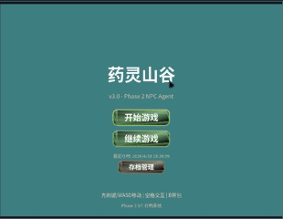
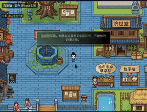
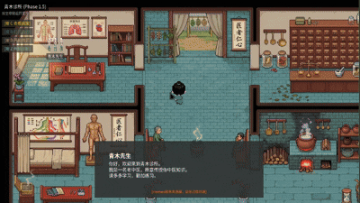

# 药灵山谷 (Yaoling Shangu)

一款2D像素风格的中医学习游戏，在探索药王谷的过程中学习中医知识。

## 游戏演示

### 药园区域



### 诊所区域



### NPC对话系统


### 病案系统


### 辨证系统


### 煎药系统


### 炮制系统


### 背包系统



## 技术栈

- **游戏引擎**: Phaser 3
- **语言**: TypeScript
- **构建工具**: Vite
- **NPC系统**: Hermes-Agent (LLM驱动的智能NPC)

## 快速开始

### 基础启动（仅游戏前端）

```bash
# 安装依赖
npm install

# 启动开发服务器
npm run dev

# 构建生产版本
npm run build

# 预览构建结果
npm run preview
```

### 完整启动（含NPC对话系统）

如需启用NPC智能对话功能，需同时启动 Hermes Agent 后端：

```bash
# 1. 启动 Hermes Backend（NPC Agent服务）
cd hermes_backend && python3 main.py

# 2. 启动游戏前端（新终端窗口）
npm run dev
```

#### 服务端口说明

| 服务 | 端口 | 检查命令 |
|------|------|----------|
| 游戏前端 | 3000 | `curl http://localhost:3000` |
| Hermes后端 | 8642 | `curl http://localhost:8642/health` |

#### Hermes 配置

Hermes Backend 需要配置 LLM API 密钥，请将密钥放入 `~/.hermes/.env` 文件：

**配置文件示例**（`~/.hermes/.env`）：
```
阿里云百炼密钥配置
API_BASE=https://dashscope.aliyuncs.com/compatible-mode/v1
MODEL_NAME=glm-5
```

**注意**: API密钥是敏感信息，请勿提交到代码仓库。配置文件中需要设置密钥变量。

#### NPC对话触发方式

- **欢迎对话（自动）**：进入诊所后自动显示青木先生欢迎对话
- **用户触发（空格键）**：靠近NPC时按空格键触发对话

## 测试

```bash
# 运行单元测试
npm run test:unit

# 运行集成测试
npm run test:integration

# 运行E2E测试
npm run test:e2e

# 测试覆盖率
npm run test:coverage
```

## 项目结构

```
src/
├── main.ts              # 游戏入口
├── config/              # Phaser配置
├── data/                # 游戏数据(药材、病案、方剂等)
├── scenes/              # Phaser场景(室外、诊所、药园等)
├── entities/            # 游戏实体(Player等)
├── systems/             # 系统管理器(背包、煎药、炮制等)
├── ui/                  # UI组件(对话、问诊、诊治等)
└── utils/               # 工具函数

hermes_backend/          # NPC Agent后端服务
├── main.py              # Hermes服务入口
├── gateway/             # LLM流式响应处理
├── tools/               # NPC游戏工具(查询进度、启动游戏等)
└── npc_profile.py       # NPC身份配置

hermes/npcs/qingmu/      # NPC青木先生配置
├── skills/              # NPC技能文档(教学大纲、提问技巧等)
└── profile.json         # NPC身份定义
```

## 核心功能

- **AI NPC对话** - 与青木医生等NPC自然对话，智能引导学习
- **病案系统** - 查看学习过的病案记录
- **问诊系统** - 收集病人症状线索
- **诊治流程** - 脉诊、舌诊、辨证、选方
- **药材炮制** - 学习药材炮制方法
- **煎药游戏** - 掌握煎药火候与顺序
- **药园种植** - 种植并照料中药材

## NPC 工具说明

NPC 青木先生可通过 Hermes 调用以下工具：

| 工具 | 功能 | 触发时机 |
|------|------|----------|
| `get_learning_progress` | 查询学习进度 | 对话开始、安排新任务前 |
| `get_case_progress` | 查询病案进度 | 了解实践情况 |
| `get_inventory` | 查询背包 | 评估药材储备 |
| `trigger_minigame` | 启动小游戏 | 讲解完毕后自动触发 |
| `record_weakness` | 记录薄弱点 | 发现理解偏差时 |
| `get_npc_memory` | 获取NPC记忆 | 个性化开场对话 |
| `create_task` | 创建学习任务 | 布置新作业 |
| `update_todo` | 更新掌握程度 | 更新知识点状态 |

## 文档

详细设计文档位于 `docs/superpowers/specs/`，实现计划位于 `docs/superpowers/plans/`。

## 许可证

MIT