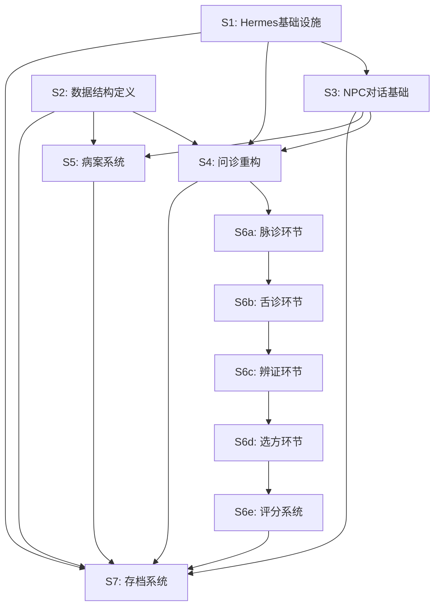

# Phase 2: NPC Agent系统实现计划

> **For agentic workers:** REQUIRED SUB-SKILL: Use superpowers:subagent-driven-development (recommended) or superpowers:executing-plans to implement this plan task-by-task. Steps use checkbox (`- [ ]`) syntax for tracking.

**Goal:** 复用Hermes-Agent架构实现AI驱动的NPC系统，玩家可与NPC对话、诊治病人、追踪学习进度

**Architecture:** Hermes Python后端提供AIAgent对话引擎+SessionDB记忆系统，通过GameAdapter接入Phaser游戏前端，SSE流式输出用于UI逐字显示

**Tech Stack:** TypeScript (Phaser 3) + Python (Hermes-Agent) + SQLite (SessionDB) + SSE (流式输出)

---

## 前置条件确认

- [ ] hermes-agent项目存在于 ~/Desktop/hermes-agent
- [ ] claw-code项目存在于 ~/Desktop/claw-code
- [ ] Phase 1.5 已完成（游戏世界视觉呈现）
- [ ] 游戏基础框架可正常运行

---

## 文件结构规划

### 新增文件清单

```
zhongyi_game_v3/
├── src/
│   ├── systems/
│   │   ├── HermesManager.ts       # Hermes进程管理
│   │   ├── NPCInteraction.ts      # NPC交互系统
│   │   ├── ClueTracker.ts         # 线索追踪
│   │   ├── CaseManager.ts         # 病案管理
│   │   ├── SaveManager.ts         # 存档管理
│   │   ├── GameState.ts           # 游戏状态收集
│   │   ├── ScoringSystem.ts       # 评分系统
│   │   └── DiagnosisFlowManager.ts # 诊治流程管理
│   ├── scenes/
│   │   ├── InquiryScene.ts        # 问诊场景
│   │   ├── PulseScene.ts          # 脉诊场景
│   │   ├── TongueScene.ts         # 舌诊场景
│   │   ├── SyndromeScene.ts       # 辨证场景
│   │   ├── PrescriptionScene.ts   # 选方场景
│   │   └── DecoctionScene.ts      # 煎药场景
│   ├── ui/
│   │   ├── DialogUI.ts            # 对话界面
│   │   ├── StreamingText.ts       # 流式文字
│   │   ├── InquiryUI.ts           # 问诊界面
│   │   ├── ClueTrackerUI.ts       # 线索追踪UI
│   │   ├── CasesListUI.ts         # 病案列表
│   │   ├── CaseDetailUI.ts        # 病案详情
│   │   ├── PulseUI.ts             # 脉诊界面
│   │   ├── TongueUI.ts            # 舌诊界面
│   │   ├── SyndromeUI.ts          # 辨证界面
│   │   ├── PrescriptionUI.ts      # 选方界面
│   │   ├── ResultUI.ts            # 结果页面
│   │   ├── NPCFeedbackUI.ts       # NPC点评
│   │   ├── SaveUI.ts              # 存档界面
│   │   └── InfoSummaryUI.ts       # 信息汇总
│   ├── utils/
│   │   ├── sseClient.ts           # SSE客户端
│   │   └── apiClient.ts           # API客户端
│   └── data/
│       ├── cases/
│       │   ├── core_cases.json    # 核心病案
│       │   └── free_cases.json    # 自由病案
│       ├── patient-templates/
│       │   ├── farmer.json
│       │   ├── merchant.json
│       │   ├── scholar.json
│       │   ├── elder.json
│       │   └── child.json
│       ├── pulse_descriptions.json # 脉象描述
│       ├── prescriptions.json     # 方剂数据
│       └── save.json              # 存档文件
│
├── hermes/                        # Hermes配置和NPC文件
│   ├── npcs/
│   │   └── qingmu/
│   │       ├── SOUL.md            # NPC身份
│   │       ├── MEMORY.md          # NPC记忆
│   │       ├── USER.md            # 玩家观察
│   │       ├── SYLLABUS.md        # 教学大纲
│   │       └── TASKS.json         # 任务列表
│   └── skills/
│       └── tcm-knowledge/
│           ├── prescriptions/
│           ├── herbs/
│           └── diagnosis/
│
├── gateway/                       # Hermes GameAdapter
│   └── platforms/
│       └── game_adapter.py        # 游戏Adapter
│
├── tools/                         # Hermes游戏工具
│   └── game_tools.py              # 游戏工具注册
│
└── tests/
    ├── unit/
    │   ├── hermes.spec.ts         # Hermes单元测试
    │   ├── data-structure.spec.ts # 数据结构测试
    │   └── scoring.spec.ts        # 评分单元测试
    └── e2e/
        ├── npc-dialog.spec.ts     # NPC对话E2E
        ├── inquiry.spec.ts        # 问诊E2E
        ├── cases.spec.ts          # 病案E2E
        ├── diagnosis/
        │   ├── pulse.spec.ts      # 脉诊E2E
        │   ├── tongue.spec.ts     # 舌诊E2E
        │   ├── syndrome.spec.ts   # 辨证E2E
        │   ├── prescription.spec.ts # 选方E2E
        │   └── full-flow.spec.ts  # 完整诊治E2E
        └── save.spec.ts           # 存档E2E
```

---

## S1: Hermes基础设施

**依赖:** 无

**目标:** 复用hermes-agent项目，通过Gateway接入游戏，实现自动启动+健康检查+SSE流式输出

### Task S1.1: 检查hermes-agent项目结构

**Files:**
- 参考: `~/Desktop/hermes-agent/` 目录结构

- [ ] **Step 1: 验证hermes-agent核心文件存在**

Run: `ls -la ~/Desktop/hermes-agent/run_agent.py ~/Desktop/hermes-agent/hermes_state.py ~/Desktop/hermes-agent/gateway/run.py ~/Desktop/hermes-agent/tools/todo_tool.py`
Expected: 所有文件存在

- [ ] **Step 2: 验证hermes-agent可运行**

Run: `cd ~/Desktop/hermes-agent && python -c "from run_agent import AIAgent; print('OK')"`
Expected: 输出 "OK"

### Task S1.2: 创建Hermes配置

**Files:**
- Create: `zhongyi_game_v3/hermes_cli/config.py`

- [ ] **Step 1: 写配置文件**

```python
# hermes_cli/config.py
"""游戏模式Hermes配置"""

import os

# 游戏数据目录
GAME_DATA_DIR = os.path.join(os.path.dirname(__file__), '..', 'src', 'data')

# Hermes运行模式
HERMES_GAME_MODE = os.environ.get('HERMES_GAME_MODE', 'true')

# API端口
GAME_API_PORT = int(os.environ.get('GAME_API_PORT', 8642))

# NPC目录
NPC_DIR = os.path.join(os.path.dirname(__file__), '..', 'hermes', 'npcs')

# 默认NPC模型
DEFAULT_NPC_MODEL = "anthropic/claude-opus-4.6"
```

- [ ] **Step 2: 验证配置文件语法**

Run: `cd /home/lixiang/Desktop/zhongyi_game_v3 && python -c "from hermes_cli.config import GAME_DATA_DIR; print(GAME_DATA_DIR)"`
Expected: 输出路径字符串

### Task S1.3: 创建GameAdapter

**Files:**
- Create: `gateway/platforms/game_adapter.py`
- 参考: `~/Desktop/hermes-agent/gateway/platforms/telegram.py`

- [ ] **Step 1: 创建GameAdapter骨架**

```python
# gateway/platforms/game_adapter.py
"""
游戏平台Adapter，将Hermes接入Phaser游戏前端。

参考: gateway/platforms/telegram.py
"""

import asyncio
import json
from typing import Optional, Callable
from dataclasses import dataclass

# 导入Hermes核心组件
import sys
sys.path.insert(0, '~/Desktop/hermes-agent')
from run_agent import AIAgent
from hermes_state import SessionDB


@dataclass
class GameSession:
    player_id: str
    npc_id: str
    session_id: str


class GameAdapter:
    """游戏平台Adapter"""

    def __init__(self, data_dir: str, port: int = 8642):
        self.data_dir = data_dir
        self.port = port
        self.session_db = SessionDB(db_path=f"{data_dir}/game_sessions.db")
        self._stream_callbacks: dict[str, Callable] = {}

    async def handle_player_message(
        self,
        player_id: str,
        npc_id: str,
        message: str,
        on_chunk: Optional[Callable[[str], None]] = None
    ) -> dict:
        """
        处理玩家发送给NPC的消息。

        Args:
            player_id: 玩家ID
            npc_id: NPC ID（如 "qingmu"）
            message: 玩家消息
            on_chunk: 流式输出回调

        Returns:
            {"response": str, "tool_calls": list, "session_id": str}
        """
        session_id = f"{npc_id}_{player_id}"
        session = self.session_db.get_session(session_id)

        if session is None:
            # 创建新会话
            session = self.session_db.create_session(
                source="game",
                user_id=player_id,
                model="anthropic/claude-opus-4.6",
                system_prompt=f"NPC: {npc_id}"
            )

        # 注册流式回调
        if on_chunk:
            self._stream_callbacks[session_id] = on_chunk

        # 创建AIAgent
        agent = AIAgent(
            model="anthropic/claude-opus-4.6",
            platform="game",
            session_id=session.id,
            skip_context_files=False,
            skip_memory=False
        )

        # 获取对话历史
        history = self.session_db.get_messages(session.id)

        # 运行对话
        result = await agent.run_conversation(
            user_message=message,
            conversation_history=history
        )

        # 保存对话历史
        self.session_db.save_messages(session.id, result["messages"])

        return {
            "response": result["response"],
            "tool_calls": result.get("tool_calls", []),
            "session_id": session.id
        }

    def get_session_history(self, session_id: str) -> list:
        """获取会话历史"""
        return self.session_db.get_messages(session_id)

    def search_history(self, query: str, npc_id: str, player_id: str) -> list:
        """搜索对话历史（FTS5）"""
        session_id = f"{npc_id}_{player_id}"
        return self.session_db.search_messages(session_id, query)
```

- [ ] **Step 2: 验证GameAdapter可导入**

Run: `cd /home/lixiang/Desktop/zhongyi_game_v3 && python -c "from gateway.platforms.game_adapter import GameAdapter; print('OK')"`
Expected: 输出 "OK"

### Task S1.4: 创建HermesManager（游戏端）

**Files:**
- Create: `src/systems/HermesManager.ts`

- [ ] **Step 1: 写HermesManager类型定义**

```typescript
// src/systems/HermesManager.ts
/**
 * Hermes进程管理器
 * 负责：启动Python进程、健康检查、进程生命周期管理
 */

import { spawn, ChildProcess } from 'child_process';

export interface HermesConfig {
  hermesDir: string;        // hermes-agent项目目录
  gameDataDir: string;      // 游戏数据目录
  port: number;             // API端口
  startupTimeout: number;   // 启动超时（秒）
}

export interface HermesStatus {
  available: boolean;
  pid?: number;
  port?: number;
  error?: string;
}

export class HermesManager {
  private process: ChildProcess | null = null;
  private config: HermesConfig;
  private status: HermesStatus = { available: false };

  constructor(config: HermesConfig) {
    this.config = config;
  }

  /**
   * 检查Hermes服务是否可用
   */
  async checkAvailable(): Promise<boolean> {
    try {
      const response = await fetch(`http://localhost:${this.config.port}/health`, {
        method: 'GET',
        signal: AbortSignal.timeout(5000)
      });
      this.status.available = response.ok;
      this.status.port = this.config.port;
      return response.ok;
    } catch (error) {
      this.status.available = false;
      this.status.error = String(error);
      return false;
    }
  }

  /**
   * 启动Hermes Python进程
   */
  async start(): Promise<HermesStatus> {
    // 先检查是否已运行
    if (await this.checkAvailable()) {
      console.log('[HermesManager] Hermes already running');
      return this.status;
    }

    console.log('[HermesManager] Starting Hermes...');

    // 设置环境变量
    const env = {
      ...process.env,
      HERMES_GAME_MODE: 'true',
      HERMES_HOME: this.config.gameDataDir,
      GAME_API_PORT: String(this.config.port)
    };

    // 启动Python进程
    this.process = spawn('python', ['-m', 'gateway.run'], {
      cwd: this.config.hermesDir,
      env,
      stdio: ['pipe', 'pipe', 'pipe']
    });

    // 监听输出
    this.process.stdout?.on('data', (data) => {
      console.log('[Hermes]', data.toString());
    });

    this.process.stderr?.on('data', (data) => {
      console.error('[Hermes Error]', data.toString());
    });

    // 等待就绪
    const startTime = Date.now();
    const timeout = this.config.startupTimeout * 1000;

    while (Date.now() - startTime < timeout) {
      if (await this.checkAvailable()) {
        this.status.pid = this.process.pid;
        console.log('[HermesManager] Hermes started successfully');
        return this.status;
      }
      await new Promise(resolve => setTimeout(resolve, 1000));
    }

    // 超时
    this.status.error = 'Hermes startup timeout';
    this.stop();
    return this.status;
  }

  /**
   * 停止Hermes进程
   */
  stop(): void {
    if (this.process) {
      this.process.kill('SIGTERM');
      this.process = null;
      this.status.available = false;
      console.log('[HermesManager] Hermes stopped');
    }
  }

  /**
   * 获取当前状态
   */
  getStatus(): HermesStatus {
    return this.status;
  }
}
```

- [ ] **Step 2: 编译TypeScript检查语法**

Run: `cd /home/lixiang/Desktop/zhongyi_game_v3 && npx tsc --noEmit src/systems/HermesManager.ts`
Expected: 无错误输出

### Task S1.5: 创建SSE客户端

**Files:**
- Create: `src/utils/sseClient.ts`

- [ ] **Step 1: 写SSE客户端**

```typescript
// src/utils/sseClient.ts
/**
 * SSE流式输出客户端
 * 参考: hermes-agent gateway/stream_consumer.py
 */

export interface SSEOptions {
  url: string;
  body: object;
  onChunk: (text: string) => void;
  onComplete: (fullResponse: string) => void;
  onError: (error: Error) => void;
}

export interface ChatRequest {
  npc_id: string;
  player_id: string;
  user_message: string;
}

export class SSEClient {
  private abortController: AbortController | null = null;
  private baseUrl: string;

  constructor(baseUrl: string = 'http://localhost:8642') {
    this.baseUrl = baseUrl;
  }

  /**
   * 发送聊天请求，流式接收响应
   */
  async chatStream(
    request: ChatRequest,
    onChunk: (text: string) => void,
    onComplete: (fullResponse: string) => void,
    onError: (error: Error) => void
  ): Promise<void> {
    this.abortController = new AbortController();

    try {
      const response = await fetch(`${this.baseUrl}/v1/chat/stream`, {
        method: 'POST',
        headers: { 'Content-Type': 'application/json' },
        body: JSON.stringify(request),
        signal: this.abortController.signal
      });

      if (!response.ok) {
        throw new Error(`HTTP ${response.status}: ${response.statusText}`);
      }

      const reader = response.body?.getReader();
      if (!reader) {
        throw new Error('No response body');
      }

      const decoder = new TextDecoder();
      let fullResponse = '';
      let buffer = '';

      while (true) {
        const { done, value } = await reader.read();
        if (done) break;

        buffer += decoder.decode(value, { stream: true });

        // 解析SSE格式: "data: {text}\n\n"
        const lines = buffer.split('\n\n');
        buffer = lines.pop() || '';

        for (const line of lines) {
          if (line.startsWith('data: ')) {
            const data = line.slice(6);
            if (data === '[DONE]') {
              onComplete(fullResponse);
              return;
            }
            try {
              const parsed = JSON.parse(data);
              if (parsed.text) {
                fullResponse += parsed.text;
                onChunk(parsed.text);
              }
            } catch {
              // 非JSON格式，直接作为文本
              fullResponse += data;
              onChunk(data);
            }
          }
        }
      }

      onComplete(fullResponse);
    } catch (error) {
      if (error instanceof Error && error.name === 'AbortError') {
        // 用户主动中断，不算错误
        onComplete(onChunk.toString());
      } else {
        onError(error instanceof Error ? error : new Error(String(error)));
      }
    }
  }

  /**
   * 停止生成
   */
  stop(): void {
    if (this.abortController) {
      this.abortController.abort();
      this.abortController = null;
    }
  }

  /**
   * 检查是否正在生成
   */
  isGenerating(): boolean {
    return this.abortController !== null;
  }
}
```

- [ ] **Step 2: 编译TypeScript检查语法**

Run: `cd /home/lixiang/Desktop/zhongyi_game_v3 && npx tsc --noEmit src/utils/sseClient.ts`
Expected: 无错误输出

### Task S1.6: 集成到游戏启动

**Files:**
- Modify: `src/main.ts`

- [ ] **Step 1: 读取现有main.ts**

Run: `cat src/main.ts`
Expected: 显示现有代码

- [ ] **Step 2: 添加Hermes启动逻辑**

在游戏启动前添加Hermes检查和启动：

```typescript
// src/main.ts 添加内容
import { HermesManager } from './systems/HermesManager';

async function startGame() {
  // Hermes配置
  const hermesConfig = {
    hermesDir: '~/Desktop/hermes-agent',
    gameDataDir: './src/data',
    port: 8642,
    startupTimeout: 30
  };

  const hermesManager = new HermesManager(hermesConfig);

  // 检查并启动Hermes
  const status = await hermesManager.start();

  if (!status.available) {
    // 显示错误提示（需要UI组件支持）
    console.error('[Game] Hermes unavailable:', status.error);
    // TODO: 显示错误界面，提供重试按钮
    return;
  }

  console.log('[Game] Hermes ready, starting Phaser...');

  // 原有的Phaser启动代码...
  // new Phaser.Game(config);
}

startGame();
```

- [ ] **Step 3: 验证游戏可启动**

Run: `npm run dev`
Expected: 游戏启动，控制台显示Hermes状态日志

### Task S1.7: 创建Hermes单元测试

**Files:**
- Create: `tests/unit/hermes.spec.ts`

- [ ] **Step 1: 写Smoke测试代码**

```typescript
// tests/phase2/smoke/hermes-startup.spec.ts
import { test, expect } from '@playwright/test';

test.describe('Hermes Startup Smoke Tests (S1-S001~S003)', () => {
  test('S1-S001: Hermes process should start automatically', async ({ page }) => {
    await page.goto('http://localhost:5173');

    // 等待游戏加载
    await page.waitForTimeout(5000);

    // 检查控制台日志（需要通过GameState暴露）
    const hermesStatus = await page.evaluate(() => {
      return window.__HERMES_STATUS__;
    });

    expect(hermesStatus?.available).toBe(true);
    expect(hermesStatus?.pid).toBeDefined();
  });

  test('S1-S002: API health check should return 200', async ({ page }) => {
    await page.goto('http://localhost:5173');
    await page.waitForTimeout(3000);

    // 直接调用API
    const response = await page.evaluate(async () => {
      const res = await fetch('http://localhost:8642/health');
      return { status: res.status, ok: res.ok };
    });

    expect(response.status).toBe(200);
    expect(response.ok).toBe(true);
  });

  test('S1-S003: Basic chat API should respond', async ({ page }) => {
    await page.goto('http://localhost:5173');
    await page.waitForTimeout(3000);

    const response = await page.evaluate(async () => {
      const res = await fetch('http://localhost:8642/v1/chat', {
        method: 'POST',
        headers: { 'Content-Type': 'application/json' },
        body: JSON.stringify({
          npc_id: 'qingmu',
          player_id: 'test_player',
          user_message: '你好'
        })
      });
      const data = await res.json();
      return { status: res.status, hasResponse: !!data.response };
    });

    expect(response.status).toBe(200);
    expect(response.hasResponse).toBe(true);
  });
});
```

- [ ] **Step 2: 写功能测试代码**

```typescript
// tests/phase2/functional/hermes-lifecycle.spec.ts
import { test, expect } from '@playwright/test';

test.describe('Hermes Lifecycle Functional Tests (S1-F001~F005)', () => {
  test.beforeEach(async ({ page }) => {
    await page.goto('http://localhost:5173');
    await page.waitForTimeout(3000);
  });

  test('S1-F001: SSE streaming output format', async ({ page }) => {
    const chunks = await page.evaluate(async () => {
      const chunks: string[] = [];

      const response = await fetch('http://localhost:8642/v1/chat/stream', {
        method: 'POST',
        headers: { 'Content-Type': 'application/json' },
        body: JSON.stringify({
          npc_id: 'qingmu',
          player_id: 'test_player',
          user_message: '请介绍一下麻黄汤'
        })
      });

      const reader = response.body?.getReader();
      if (!reader) return chunks;

      const decoder = new TextDecoder();
      while (true) {
        const { done, value } = await reader.read();
        if (done) break;
        chunks.push(decoder.decode(value));
      }

      return chunks;
    });

    // SSE应该返回多个chunk，不是一次性返回
    expect(chunks.length).toBeGreaterThan(1);

    // 检查SSE格式 (data: ...\n\n)
    for (const chunk of chunks) {
      expect(chunk).toMatch(/^data: /);
    }
  });

  test('S1-F003: Startup timeout handling (30s)', async ({ page }) => {
    // 模拟Hermes启动超时场景
    // 需要在测试环境中设置HERMES_STARTUP_TIMEOUT=30
    const status = await page.evaluate(async () => {
      // 等待足够长时间
      await new Promise(r => setTimeout(r, 35000));
      return window.__HERMES_STATUS__;
    });

    // 如果Hermes启动成功，状态应该是available
    // 如果超时，应该显示错误
    if (!status?.available) {
      expect(status?.error).toContain('timeout');
    }
  });

  test('S1-F005: No duplicate process when already running', async ({ page }) => {
    // 先检查Hermes是否已运行
    const status1 = await page.evaluate(() => window.__HERMES_STATUS__);

    // 刷新页面（重新触发启动检查）
    await page.reload();
    await page.waitForTimeout(3000);

    const status2 = await page.evaluate(() => window.__HERMES_STATUS__);

    // PID应该相同（没有创建新进程）
    expect(status2?.pid).toBe(status1?.pid);
  });
});
```

- [ ] **Step 3: 写逻辑测试代码**

```typescript
// tests/unit/hermes.spec.ts
import { describe, it, expect, vi } from 'vitest';
import { HermesManager } from '../../src/systems/HermesManager';
import { SSEClient } from '../../src/utils/sseClient';

describe('HermesManager Unit Tests (S1-L001~L003)', () => {
  it('S1-L001: Status should match actual process state', () => {
    const manager = new HermesManager({
      hermesDir: '~/Desktop/hermes-agent',
      gameDataDir: './src/data',
      port: 8642,
      startupTimeout: 30
    });

    // 初始状态
    const initialStatus = manager.getStatus();
    expect(initialStatus.available).toBe(false);
    expect(initialStatus.pid).toBeUndefined();

    // 模拟启动后的状态检查（需要mock）
    // 实际测试需要真实的Hermes进程
  });

  it('S1-L002: stop() should interrupt SSE stream correctly', () => {
    const client = new SSEClient('http://localhost:8642');

    // 初始状态：不生成中
    expect(client.isGenerating()).toBe(false);

    // 模拟生成中状态（实际需要mock fetch）
    // client.chatStream(...)
    // expect(client.isGenerating()).toBe(true);

    // 停止后：不再生成
    client.stop();
    expect(client.isGenerating()).toBe(false);
  });

  it('S1-L003: GameAdapter config should pass to AIAgent', () => {
    // 这个测试需要在Python端执行
    // 验证：player_id, npc_id, session_id正确传递
    // 实际测试需要检查Hermes日志或返回值
  });

  describe('SSEClient', () => {
    it('should create instance', () => {
      const client = new SSEClient('http://localhost:8642');
      expect(client).toBeDefined();
    });

    it('should not be generating initially', () => {
      const client = new SSEClient('http://localhost:8642');
      expect(client.isGenerating()).toBe(false);
    });

    it('should stop generation', () => {
      const client = new SSEClient('http://localhost:8642');
      client.stop();
      expect(client.isGenerating()).toBe(false);
    });
  });
});
```

- [ ] **Step 4: 运行Smoke测试**

Run: `npx playwright test tests/phase2/smoke/hermes-startup.spec.ts --workers=1`
Expected: 3个测试通过

- [ ] **Step 5: 运行功能测试**

Run: `npx playwright test tests/phase2/functional/hermes-lifecycle.spec.ts --workers=1`
Expected: 4个测试通过

- [ ] **Step 6: 运行逻辑测试**

Run: `npm run test:unit tests/unit/hermes.spec.ts`
Expected: 6个测试通过

### Task S1.8: 提交S1完成

- [ ] **Step 1: 检查git状态**

Run: `git status`
Expected: 显示新增文件列表

- [ ] **Step 2: 提交代码**

```bash
git add gateway/platforms/game_adapter.py
git add src/systems/HermesManager.ts
git add src/utils/sseClient.ts
git add tests/unit/hermes.spec.ts
git add hermes_cli/config.py
git commit -m "$(cat <<'EOF'
feat(phase2): add Hermes infrastructure (S1)

- Add GameAdapter for Hermes-game integration
- Add HermesManager for process lifecycle
- Add SSEClient for streaming output
- Add unit tests for Hermes components

Co-Authored-By: Claude Opus 4.6 <noreply@anthropic.com>
EOF
)"
```

---

## S2: 数据结构定义

**依赖:** 无

**目标:** 创建TASKS.json、SYLLABUS.md、core_cases.json骨架，定义GameTask/GameTodo数据结构

### Task S2.1: 创建NPC目录结构

**Files:**
- Create: `hermes/npcs/qingmu/` 目录

- [ ] **Step 1: 创建目录**

Run: `mkdir -p hermes/npcs/qingmu hermes/skills/tcm-knowledge/prescriptions hermes/skills/tcm-knowledge/herbs hermes/skills/tcm-knowledge/diagnosis`
Expected: 目录创建成功

### Task S2.2: 创建青木SOUL.md

**Files:**
- Create: `hermes/npcs/qingmu/SOUL.md`

- [ ] **Step 1: 写SOUL.md**

```markdown
# 青木先生 - NPC身份定义

## 基本信息

- **姓名**: 青木
- **职业**: 百草镇唯一的中医师，三代行医
- **专长**: 伤寒论，外感病诊治
- **性格**: 稳重温和、循循善诱、耐心细致
- **说话风格**: 古朴典雅，善用医典引用，语气平和

## 教学风格

- **引导式教学**: 不直接给出答案，而是通过问题引导学生思考
- **案例驱动**: 通过真实病案让学生实践
- **及时反馈**: 每次诊治后给予详细点评
- **循序渐进**: 从简单证型开始，逐步深入

## 典型对话示例

玩家问："这个病人为什么怕冷？"

青木答："你可还记得《伤寒论》开篇所言？'太阳之为病，脉浮，头项强痛而恶寒。'
这恶寒，正是太阳表证的核心症状。但你要问的是——这恶寒，是风寒束表所致，
还是营卫不和所致？这便是辨证的关键所在。"

## 专业背景

- 精通《伤寒论》前三篇
- 擅长麻黄汤、桂枝汤、银翘散、桑菊饮四方应用
- 对风寒表实、风寒表虚、风热犯卫、风温咳嗽四证有深入研究
```

- [ ] **Step 2: 验证文件创建**

Run: `cat hermes/npcs/qingmu/SOUL.md | head -5`
Expected: 显示前5行内容

### Task S2.3: 创建青木MEMORY.md

**Files:**
- Create: `hermes/npcs/qingmu/MEMORY.md`

- [ ] **Step 1: 写MEMORY.md**

```markdown
# 青木先生 - 教学心得

## 教学方法论

### 1. 病案教学原则

- 从真实病案入手，让学生在实践中学习
- 每个病案对应一个核心知识点
- 病案难度循序渐进

### 2. 辨证思维培养

- 不急于给出答案，而是引导学生思考
- 问诊环节让学生自主收集信息
- 辨证环节要求学生论述推理过程

### 3. 薄弱点识别与强化

- 通过诊治评分识别学生薄弱环节
- 针对薄弱点推荐复习内容
- 后续病案包含薄弱点相关内容

## 常见学生问题及应对

### 问题1: 无法区分风寒表实和表虚

**应对**: 强调"汗"的关键鉴别意义
- 无汗 + 脉浮紧 = 表实（麻黄汤）
- 有汗 + 脉浮缓 = 表虚（桂枝汤）

### 问题2: 忽视问诊环节

**应对**: 设置必须线索机制
- 必须线索未收集齐，无法进入下一环节
- 在线索追踪UI显示收集进度

### 问题3: 脉诊理解困难

**应对**: 提供古文脉象描述
- 结合《脉经》原文理解脉象
- 强调脉位和脉势的判断

## 教学经验总结

- 初学者易混淆风寒和风热，需反复对比
- 脉诊需要大量练习，建议多做病案
- 论述环节是检验理解的最好方式
```

- [ ] **Step 2: 验证文件创建**

Run: `cat hermes/npcs/qingmu/MEMORY.md | head -5`
Expected: 显示前5行内容

### Task S2.4: 创建青木USER.md模板

**Files:**
- Create: `hermes/npcs/qingmu/USER.md`

- [ ] **Step 1: 写USER.md模板**

```markdown
# 青木先生 - 对玩家的观察

## 玩家基本信息

- **ID**: player_001
- **学习时长**: 0小时
- **当前进度**: 初入百草镇

## 学习特点观察

（动态更新，以下为初始模板）

### 理解能力
- 待观察

### 学习风格
- 待观察

### 薄弱环节
- 待识别

### 优势领域
- 待识别

## 对话历史摘要

（每次交互后更新）

## 下一步教学建议

1. 首次对话：引导进入诊所，开始第一个病案
2. 介绍问诊流程，讲解线索收集机制
3. 从简单的风寒表实证开始
```

- [ ] **Step 2: 验证文件创建**

Run: `cat hermes/npcs/qingmu/USER.md`
Expected: 显示完整内容

### Task S2.5: 创建教学大纲SYLLABUS.md

**Files:**
- Create: `hermes/npcs/qingmu/SYLLABUS.md`

- [ ] **Step 1: 写SYLLABUS.md**

```markdown
# 青木先生教学大纲

## 教学主线：中医内科学（外感病）

层级结构：病症 → 病类 → 证型 → 方剂

---

## 第一篇：外感病总论

### 1.1 外感病概念

- 定义：外感六淫（风、寒、暑、湿、燥、火）所致疾病
- 特点：起病急、病程短、有表证

### 1.2 辨证体系对比

| 体系 | 适用范围 | 代表著作 |
|-----|---------|---------|
| 六经辨证 | 伤寒（风寒） | 《伤寒论》 |
| 卫气营血辨证 | 温病（风热） | 《温热论》 |
| 三焦辨证 | 湿温 | 《温病条辨》 |

### 1.3 治疗原则

- 辛温解表：风寒外感
- 辛凉解表：风热外感

---

## 第二篇：风寒外感（伤寒）

### 2.1 风寒表实证（麻黄汤证）

**病机**: 风寒束表，营卫郁滞

**核心症状**:
- 恶寒重、发热轻
- **无汗**（关键鉴别）
- 头痛、身痛
- 脉浮紧

**方剂**: 麻黄汤
- 组成：麻黄、桂枝、杏仁、甘草
- 配伍：麻黄宣肺解表为君，桂枝解肌发表为臣
- 功效：发汗解表，宣肺平喘

### 2.2 风寒表虚证（桂枝汤证）

**病机**: 风邪袭表，营卫不和

**核心症状**:
- 恶风、发热
- **有汗**（关键鉴别）
- 头痛
- 脉浮缓

**方剂**: 枝汤
- 组成：桂枝、芍药、甘草、生姜、大枣
- 配伍：桂枝解肌为君，芍药敛营为臣
- 功效：解肌发表，调和营卫

---

## 第三篇：风热外感（温病）

### 3.1 风热犯卫证（银翘散证）

**核心症状**:
- 发热重、恶寒轻
- 咽痛明显
- 口渴
- 脉浮数

**方剂**: 银翘散
- 组成：金银花、连翘、薄荷、荆芥等
- 功效：辛凉解表，清热解毒

### 3.2 风温咳嗽证（桑菊饮证）

**核心症状**:
- 咳嗽为主
- 发热轻
- 微恶风
- 脉浮数

**方剂**: 桑菊饮
- 组成：桑叶、菊花、杏仁、桔梗等
- 功效：疏风清热，宣肺止咳

---

## 第四篇：综合对比与鉴别

### 4.1 四方综合鉴别表

| 方剂 | 证型 | 关键症状 | 脉象 | 汗出 |
|-----|------|---------|------|------|
| 麻黄汤 | 风寒表实 | 恶寒重无汗 | 浮紧 | 无汗 |
| 桂枝汤 | 风寒表虚 | 恶风有汗 | 浮缓 | 有汗 |
| 银翘散 | 风热犯卫 | 发热重咽痛 | 浉数 | 少汗 |
| 桑菊饮 | 风温咳嗽 | 咳嗽为主 | 浮数 | 少汗 |

### 4.2 辨证思路流程图

```
外感病 → 汗出判断
         │
    无汗 │ 有汗
         │
    风寒表实 │ 风寒表虚 / 风热
              │
         恶寒重 │ 恶风/咽痛
              │
    麻黄汤 │ 桂枝汤 / 银翘散
```

### 4.3 时令季节用药参考

- 冬季：风寒多见，宜辛温
- 春季：风热多见，宜辛凉
- 夏季：湿热夹杂，需加减
```

- [ ] **Step 2: 验证文件创建**

Run: `wc -l hermes/npcs/qingmu/SYLLABUS.md`
Expected: 输出行数 > 50

### Task S2.6: 创建TASKS.json骨架

**Files:**
- Create: `hermes/npcs/qingmu/TASKS.json`

- [ ] **Step 1: 写TASKS.json**

```json
{
  "npc_id": "qingmu",
  "player_id": "player_001",
  "last_updated": "2026-04-12T00:00:00Z",

  "tasks": [
    {
      "task_id": "mahuang-tang-learning",
      "title": "麻黄汤学习",
      "type": "prescription",
      "status": "pending",
      "progress": 0.0,
      "blocked_by": null,

      "todos": [
        {"id": "composition", "name": "组成", "mastery": 0.0, "status": "pending"},
        {"id": "compatibility", "name": "配伍", "mastery": 0.0, "status": "pending"},
        {"id": "effect", "name": "功效", "mastery": 0.0, "status": "pending"},
        {"id": "decoction", "name": "煎服法", "mastery": 0.0, "status": "pending"},
        {"id": "contraindication", "name": "禁忌", "mastery": 0.0, "status": "pending"},
        {"id": "differentiation", "name": "鉴别", "mastery": 0.0, "status": "pending"},
        {"id": "formula", "name": "方歌", "mastery": 0.0, "status": "pending"}
      ],

      "weaknesses": []
    },
    {
      "task_id": "guizhi-tang-learning",
      "title": "桂枝汤学习",
      "type": "prescription",
      "status": "pending",
      "progress": 0.0,
      "blocked_by": "mahuang-tang-learning",

      "todos": [
        {"id": "composition", "name": "组成", "mastery": 0.0, "status": "pending"},
        {"id": "compatibility", "name": "配伍", "mastery": 0.0, "status": "pending"},
        {"id": "effect", "name": "功效", "mastery": 0.0, "status": "pending"},
        {"id": "decoction", "name": "煎服法", "mastery": 0.0, "status": "pending"},
        {"id": "contraindication", "name": "禁忌", "mastery": 0.0, "status": "pending"},
        {"id": "differentiation", "name": "鉴别", "mastery": 0.0, "status": "pending"},
        {"id": "formula", "name": "方歌", "mastery": 0.0, "status": "pending"}
      ],

      "weaknesses": []
    },
    {
      "task_id": "yin-qiao-san-learning",
      "title": "银翘散学习",
      "type": "prescription",
      "status": "pending",
      "progress": 0.0,
      "blocked_by": "guizhi-tang-learning",

      "todos": [
        {"id": "composition", "name": "组成", "mastery": 0.0, "status": "pending"},
        {"id": "compatibility", "name": "配伍", "mastery": 0.0, "status": "pending"},
        {"id": "effect", "name": "功效", "mastery": 0.0, "status": "pending"},
        {"id": "decoction", "name": "煎服法", "mastery": 0.0, "status": "pending"},
        {"id": "contraindication", "name": "禁忌", "mastery": 0.0, "status": "pending"},
        {"id": "differentiation", "name": "鉴别", "mastery": 0.0, "status": "pending"},
        {"id": "formula", "name": "方歌", "mastery": 0.0, "status": "pending"}
      ],

      "weaknesses": []
    },
    {
      "task_id": "sang-ju-yin-learning",
      "title": "桑菊饮学习",
      "type": "prescription",
      "status": "pending",
      "progress": 0.0,
      "blocked_by": "yin-qiao-san-learning",

      "todos": [
        {"id": "composition", "name": "组成", "mastery": 0.0, "status": "pending"},
        {"id": "compatibility", "name": "配伍", "mastery": 0.0, "status": "pending"},
        {"id": "effect", "name": "功效", "mastery": 0.0, "status": "pending"},
        {"id": "decoction", "name": "煎服法", "mastery": 0.0, "status": "pending"},
        {"id": "contraindication", "name": "禁忌", "mastery": 0.0, "status": "pending"},
        {"id": "differentiation", "name": "鉴别", "mastery": 0.0, "status": "pending"},
        {"id": "formula", "name": "方歌", "mastery": 0.0, "status": "pending"}
      ],

      "weaknesses": []
    },
    {
      "task_id": "wind-cold-syndrome",
      "title": "风寒表实/表虚辨证",
      "type": "syndrome",
      "status": "pending",
      "progress": 0.0,
      "blocked_by": "mahuang-tang-learning",

      "todos": [
        {"id": "pathology", "name": "病机", "mastery": 0.0, "status": "pending"},
        {"id": "key_points", "name": "辨证要点", "mastery": 0.0, "status": "pending"},
        {"id": "pulse", "name": "脉诊", "mastery": 0.0, "status": "pending"},
        {"id": "tongue", "name": "舌诊", "mastery": 0.0, "status": "pending"},
        {"id": "prescription", "name": "选方", "mastery": 0.0, "status": "pending"}
      ],

      "weaknesses": []
    },
    {
      "task_id": "wind-heat-syndrome",
      "title": "风热犯卫辨证",
      "type": "syndrome",
      "status": "pending",
      "progress": 0.0,
      "blocked_by": "yin-qiao-san-learning",

      "todos": [
        {"id": "pathology", "name": "病机", "mastery": 0.0, "status": "pending"},
        {"id": "key_points", "name": "辨证要点", "mastery": 0.0, "status": "pending"},
        {"id": "pulse", "name": "脉诊", "mastery": 0.0, "status": "pending"},
        {"id": "tongue", "name": "舌诊", "mastery": 0.0, "status": "pending"},
        {"id": "prescription", "name": "选方", "mastery": 0.0, "status": "pending"}
      ],

      "weaknesses": []
    }
  ],

  "current_focus": {
    "primary_task_id": null,
    "primary_todo": null
  },

  "statistics": {
    "total_tasks": 6,
    "completed": 0,
    "in_progress": 0,
    "pending": 6,
    "mastery_average": 0.0
  }
}
```

- [ ] **Step 2: 验证JSON语法**

Run: `python -c "import json; json.load(open('hermes/npcs/qingmu/TASKS.json')); print('OK')"`
Expected: 输出 "OK"

### Task S2.7: 创建core_cases.json

**Files:**
- Create: `src/data/cases/core_cases.json`

- [ ] **Step 1: 写core_cases.json**

```json
{
  "cases": [
    {
      "case_id": "case_001",
      "case_type": "core",
      "blocked_by": "mahuang-tang-learning",

      "syndrome": {
        "type": "风寒表实证",
        "category": "风寒外感"
      },

      "prescription": {
        "name": "麻黄汤",
        "alternatives": []
      },

      "chief_complaint_template": "昨天冒雨干活后怕冷发热无汗一天",

      "clues": {
        "required": ["恶寒重", "无汗", "发热轻", "脉浮紧"],
        "auxiliary": ["身痛", "头痛", "起病原因", "口渴情况"]
      },

      "pulse": {
        "position": "浮",
        "tension": "紧",
        "description": "脉来浮取即得，重按稍减，紧如转索"
      },

      "tongue": {
        "body_color": "淡红",
        "coating": "薄白",
        "shape": "正常",
        "moisture": "润"
      },

      "difficulty": "easy",

      "teaching_notes": {
        "key_points": ["无汗是关键鉴别", "脉浮紧配合无汗确认表实"],
        "common_mistakes": ["混淆表实与表虚", "忽视汗出情况"]
      }
    },
    {
      "case_id": "case_002",
      "case_type": "core",
      "blocked_by": "guizhi-tang-learning",

      "syndrome": {
        "type": "风寒表虚证",
        "category": "风寒外感"
      },

      "prescription": {
        "name": "桂枝汤",
        "alternatives": []
      },

      "chief_complaint_template": "昨天吹风后怕风发热出汗一天",

      "clues": {
        "required": ["恶风", "有汗", "发热", "脉浮缓"],
        "auxiliary": ["头痛", "鼻鸣干呕", "起病原因"]
      },

      "pulse": {
        "position": "浮",
        "tension": "缓",
        "description": "脉来浮取即得，重按无力，缓如风吹"
      },

      "tongue": {
        "body_color": "淡红",
        "coating": "薄白",
        "shape": "正常",
        "moisture": "润"
      },

      "difficulty": "easy",

      "teaching_notes": {
        "key_points": ["有汗是关键鉴别", "脉浮缓配合有汗确认表虚"],
        "common_mistakes": ["混淆表虚与表实", "忽视汗出情况"]
      }
    },
    {
      "case_id": "case_003",
      "case_type": "core",
      "blocked_by": "yin-qiao-san-learning",

      "syndrome": {
        "type": "风热犯卫证",
        "category": "风热外感"
      },

      "prescription": {
        "name": "银翘散",
        "alternatives": []
      },

      "chief_complaint_template": "昨天开始发热嗓子疼有点怕冷",

      "clues": {
        "required": ["发热重", "咽痛", "恶寒轻", "脉浮数"],
        "auxiliary": ["口渴", "头痛", "咳嗽情况"]
      },

      "pulse": {
        "position": "浮",
        "tension": "数",
        "description": "脉来浮取即得，一息六至以上"
      },

      "tongue": {
        "body_color": "红",
        "coating": "薄黄",
        "shape": "正常",
        "moisture": "润"
      },

      "difficulty": "normal",

      "teaching_notes": {
        "key_points": ["咽痛明显是关键", "发热重恶寒轻"],
        "common_mistakes": ["混淆风寒与风热", "忽视咽痛"]
      }
    },
    {
      "case_id": "case_004",
      "case_type": "core",
      "blocked_by": "sang-ju-yin-learning",

      "syndrome": {
        "type": "风温咳嗽证",
        "category": "风热外感"
      },

      "prescription": {
        "name": "桑菊饮",
        "alternatives": []
      },

      "chief_complaint_template": "这两天咳嗽有点发热微恶风",

      "clues": {
        "required": ["咳嗽", "发热轻", "微恶风", "脉浮数"],
        "auxiliary": ["咽痒", "口渴", "痰色"]
      },

      "pulse": {
        "position": "浮",
        "tension": "数",
        "description": "脉来浮取即得，一息五六至"
      },

      "tongue": {
        "body_color": "淡红",
        "coating": "薄黄",
        "shape": "正常",
        "moisture": "润"
      },

      "difficulty": "normal",

      "teaching_notes": {
        "key_points": ["咳嗽为主是关键", "发热轻"],
        "common_mistakes": ["混淆银翘散与桑菊饮", "忽视咳嗽主症"]
      }
    }
  ]
}
```

- [ ] **Step 2: 验证JSON语法**

Run: `python -c "import json; json.load(open('src/data/cases/core_cases.json')); print('OK')"`
Expected: 输出 "OK"

### Task S2.8: 创建病人模板

**Files:**
- Create: `src/data/patient-templates/farmer.json`
- Create: `src/data/patient-templates/merchant.json`
- Create: `src/data/patient-templates/scholar.json`
- Create: `src/data/patient-templates/elder.json`
- Create: `src/data/patient-templates/child.json`

- [ ] **Step 1: 写farmer.json**

```json
{
  "template_id": "farmer",
  "occupation": "农夫",
  "speaking_style": "朴实直白",
  "age_range": [25, 50],
  "example_phrases": {
    "greeting": "大夫，您帮忙看看，我这身子...",
    "complaint_intro": "昨天在地里干活，",
    "pain_description": "疼得厉害，像被人打了一棍子似的",
    "cold_description": "冷得很，裹了棉袄还是冷",
    "heat_description": "热得难受，像是火烧一样"
  },
  "possible_contexts": ["田间劳作", "冒雨干活", "早起下地", "搬运重物"]
}
```

- [ ] **Step 2: 写merchant.json**

```json
{
  "template_id": "merchant",
  "occupation": "商人",
  "speaking_style": "文雅客气",
  "age_range": [30, 45],
  "example_phrases": {
    "greeting": "大夫好，我这几日身体有些不适...",
    "complaint_intro": "前日外出经商，",
    "pain_description": "隐隐作痛，有些不适",
    "cold_description": "有些畏寒，不甚舒适",
    "heat_description": "身热烦躁，颇为不适"
  },
  "possible_contexts": ["旅途劳累", "外出经商", "舟车劳顿", "风寒侵袭"]
}
```

- [ ] **Step 3: 写scholar.json**

```json
{
  "template_id": "scholar",
  "occupation": "书生",
  "speaking_style": "略带书卷气",
  "age_range": [20, 35],
  "example_phrases": {
    "greeting": "先生，学生近日身体有恙...",
    "complaint_intro": "这几日读书夜深，",
    "pain_description": "酸痛难忍，如针刺一般",
    "cold_description": "寒意阵阵，似秋风入骨",
    "heat_description": "燥热不安，如夏日炎炎"
  },
  "possible_contexts": ["读书久坐", "夜读伤风", "书房苦读", "迎风赶路"]
}
```

- [ ] **Step 4: 写elder.json**

```json
{
  "template_id": "elder",
  "occupation": "老人",
  "speaking_style": "缓慢虚弱",
  "age_range": [60, 75],
  "example_phrases": {
    "greeting": "大夫...我这老身子...",
    "complaint_intro": "这两天天气变化，",
    "pain_description": "疼...疼得很...",
    "cold_description": "冷...裹了被子还是冷...",
    "heat_description": "热...热得慌..."
  },
  "possible_contexts": ["体质虚弱", "天气变化", "年老体衰", "反复外感"]
}
```

- [ ] **Step 5: 写child.json**

```json
{
  "template_id": "child",
  "occupation": "儿童",
  "speaking_style": "简单直接",
  "age_range": [5, 12],
  "example_phrases": {
    "greeting": "大夫叔叔，我不舒服...",
    "complaint_intro": "昨天在外面玩，",
    "pain_description": "疼疼疼...",
    "cold_description": "好冷好冷...",
    "heat_description": "好热好热..."
  },
  "possible_contexts": ["外面玩耍", "淋雨", "吹风", "玩累了"]
}
```

- [ ] **Step 6: 验证所有模板**

Run: `python -c "import json; [json.load(open(f'src/data/patient-templates/{t}.json')) for t in ['farmer','merchant','scholar','elder','child']]; print('OK')"`
Expected: 输出 "OK"

### Task S2.9: 创建数据结构测试

**Files:**
- Create: `tests/unit/data-structure.spec.ts`
- Create: `tests/phase2/smoke/data-structure.spec.ts`
- Create: `tests/phase2/logic/blocking-dependency.spec.ts`

- [ ] **Step 1: 写Smoke测试代码**

```typescript
// tests/phase2/smoke/data-structure.spec.ts
import { test, expect } from '@playwright/test';
import fs from 'fs';
import path from 'path';

test.describe('Data Structure Smoke Tests (S2-S001~S003)', () => {
  test('S2-S001: All JSON files exist', async ({ page }) => {
    // 检查关键JSON文件存在
    const files = [
      'hermes/npcs/qingmu/TASKS.json',
      'src/data/cases/core_cases.json',
      'src/data/patient-templates/farmer.json',
      'src/data/patient-templates/merchant.json',
      'src/data/patient-templates/scholar.json',
      'src/data/patient-templates/elder.json',
      'src/data/patient-templates/child.json'
    ];

    for (const file of files) {
      expect(fs.existsSync(file)).toBe(true);
    }
  });

  test('S2-S002: All JSON files are valid syntax', async ({ page }) => {
    const files = [
      'hermes/npcs/qingmu/TASKS.json',
      'src/data/cases/core_cases.json'
    ];

    for (const file of files) {
      const content = fs.readFileSync(file, 'utf-8');
      const parsed = JSON.parse(content);
      expect(parsed).toBeDefined();
    }
  });

  test('S2-S003: NPC directory structure complete', async ({ page }) => {
    const requiredFiles = [
      'hermes/npcs/qingmu/SOUL.md',
      'hermes/npcs/qingmu/MEMORY.md',
      'hermes/npcs/qingmu/USER.md',
      'hermes/npcs/qingmu/SYLLABUS.md',
      'hermes/npcs/qingmu/TASKS.json'
    ];

    for (const file of requiredFiles) {
      expect(fs.existsSync(file)).toBe(true);
    }
  });
});
```

- [ ] **Step 2: 写功能测试代码**

```typescript
// tests/unit/data-structure.spec.ts
import { describe, it, expect } from 'vitest';
import fs from 'fs';
import path from 'path';

describe('TASKS.json Functional Tests (S2-F001~F005)', () => {
  const tasksPath = path.join(__dirname, '../../hermes/npcs/qingmu/TASKS.json');
  const tasks = JSON.parse(fs.readFileSync(tasksPath, 'utf-8'));

  it('S2-F001: should have task_id, todos, blocked_by fields', () => {
    const task = tasks.tasks[0];
    expect(task.task_id).toBeDefined();
    expect(Array.isArray(task.todos)).toBe(true);
    expect(task.blocked_by).toBeDefined();
  });

  it('S2-F002: Todo status should be valid', () => {
    const validStatuses = ['pending', 'in_progress', 'completed'];
    for (const task of tasks.tasks) {
      for (const todo of task.todos) {
        expect(validStatuses).toContain(todo.status);
      }
    }
  });

  it('S2-F003: mastery should be in range 0-1', () => {
    for (const task of tasks.tasks) {
      for (const todo of task.todos) {
        expect(todo.mastery).toBeGreaterThanOrEqual(0);
        expect(todo.mastery).toBeLessThanOrEqual(1);
      }
    }
  });

  it('S2-F004: core_cases should have required fields', () => {
    const casesPath = path.join(__dirname, '../../src/data/cases/core_cases.json');
    const casesData = JSON.parse(fs.readFileSync(casesPath, 'utf-8'));

    for (const case_ of casesData.cases) {
      expect(case_.case_id).toBeDefined();
      expect(case_.syndrome.type).toBeDefined();
      expect(Array.isArray(case_.clues.required)).toBe(true);
    }
  });

  it('S2-F005: Patient templates should have required fields', () => {
    const templatesDir = path.join(__dirname, '../../src/data/patient-templates');
    const templates = ['farmer', 'merchant', 'scholar', 'elder', 'child'];

    for (const t of templates) {
      const template = JSON.parse(fs.readFileSync(path.join(templatesDir, `${t}.json`), 'utf-8'));
      expect(template.template_id).toBe(t);
      expect(template.speaking_style).toBeDefined();
      expect(template.example_phrases.greeting).toBeDefined();
    }
  });
});
```

- [ ] **Step 3: 写逻辑测试代码**

```typescript
// tests/phase2/logic/blocking-dependency.spec.ts
import { describe, it, expect } from 'vitest';
import fs from 'fs';
import path from 'path';

describe('Blocking Dependency Logic Tests (S2-L001~L003)', () => {
  const tasksPath = path.join(__dirname, '../../hermes/npcs/qingmu/TASKS.json');
  const tasks = JSON.parse(fs.readFileSync(tasksPath, 'utf-8'));

  it('S2-L001: No circular dependencies in blocked_by', () => {
    const visited = new Set<string>();
    const checkCircular = (taskId: string, chain: string[]): boolean => {
      if (chain.includes(taskId)) return true; // 循环依赖
      if (visited.has(taskId)) return false;
      visited.add(taskId);

      const task = tasks.tasks.find(t => t.task_id === taskId);
      if (task?.blocked_by) {
        return checkCircular(task.blocked_by, [...chain, taskId]);
      }
      return false;
    };

    for (const task of tasks.tasks) {
      expect(checkCircular(task.task_id, [])).toBe(false);
    }
  });

  it('S2-L002: All blocked_by references exist', () => {
    const taskIds = new Set(tasks.tasks.map(t => t.task_id));

    for (const task of tasks.tasks) {
      if (task.blocked_by) {
        expect(taskIds).toContain(task.blocked_by);
      }
    }
  });

  it('S2-L003: statistics fields match actual data', () => {
    const actualCompleted = tasks.tasks.filter(t => t.status === 'completed').length;
    const actualInProgress = tasks.tasks.filter(t => t.status === 'in_progress').length;
    const actualPending = tasks.tasks.filter(t => t.status === 'pending').length;

    expect(tasks.statistics.completed).toBe(actualCompleted);
    expect(tasks.statistics.in_progress).toBe(actualInProgress);
    expect(tasks.statistics.pending).toBe(actualPending);
    expect(tasks.statistics.total_tasks).toBe(tasks.tasks.length);
  });

  it('S2-L003-extended: Todo summary matches todos array', () => {
    for (const task of tasks.tasks) {
      const completedTodos = task.todos.filter(t => t.status === 'completed').length;
      const pendingTodos = task.todos.filter(t => t.status === 'pending').length;
      const inProgressTodos = task.todos.filter(t => t.status === 'in_progress').length;

      expect(task.summary.completed).toBe(completedTodos);
      expect(task.summary.pending).toBe(pendingTodos);
      expect(task.summary.in_progress).toBe(inProgressTodos);
    }
  });
});
```

- [ ] **Step 4: 运行Smoke测试**

Run: `npx playwright test tests/phase2/smoke/data-structure.spec.ts --workers=1`
Expected: 3个测试通过

- [ ] **Step 5: 运行功能测试**

Run: `npm run test:unit tests/unit/data-structure.spec.ts`
Expected: 5个测试通过

- [ ] **Step 6: 运行逻辑测试**

Run: `npm run test:unit tests/phase2/logic/blocking-dependency.spec.ts`
Expected: 4个测试通过

### Task S2.10: 提交S2完成

- [ ] **Step 1: 检查git状态**

Run: `git status`
Expected: 显示新增文件列表

- [ ] **Step 2: 提交代码**

```bash
git add hermes/npcs/qingmu/
git add hermes/skills/tcm-knowledge/
git add src/data/cases/core_cases.json
git add src/data/patient-templates/
git add tests/unit/data-structure.spec.ts
git commit -m "$(cat <<'EOF'
feat(phase2): add data structure definitions (S2)

- Add NPC files (SOUL.md, MEMORY.md, USER.md, SYLLABUS.md, TASKS.json)
- Add core_cases.json with 4 teaching cases
- Add patient templates (farmer, merchant, scholar, elder, child)
- Add data structure validation tests

Co-Authored-By: Claude Opus 4.6 <noreply@anthropic.com>
EOF
)"
```

---

## S3: NPC对话基础

**依赖:** S1 (Hermes基础设施)

**目标:** 进入诊所可与青木先生对话，流式输出，复用Hermes AIAgent

### Task S3.1: 创建DialogUI组件

**Files:**
- Create: `src/ui/DialogUI.ts`

- [ ] **Step 1: 写DialogUI**

```typescript
// src/ui/DialogUI.ts
/**
 * NPC对话界面组件
 * 显示流式对话文字，支持停止生成
 */

import Phaser from 'phaser';
import { SSEClient } from '../utils/sseClient';

export interface DialogUIConfig {
  npcId: string;
  npcName: string;
  npcAvatarKey: string;  // Phaser纹理key
  playerId: string;
  onComplete?: () => void;
}

export class DialogUI extends Phaser.GameObjects.Container {
  private background: Phaser.GameObjects.Rectangle;
  private avatar: Phaser.GameObjects.Image;
  private nameText: Phaser.GameObjects.Text;
  private contentText: Phaser.GameObjects.Text;
  private stopButton: Phaser.GameObjects.Text;
  private sseClient: SSEClient;
  private config: DialogUIConfig;
  private currentText: string = '';
  private isGenerating: boolean = false;

  constructor(scene: Phaser.Scene, x: number, y: number, config: DialogUIConfig) {
    super(scene, x, y);
    this.config = config;
    this.sseClient = new SSEClient();

    // 创建背景
    this.background = scene.add.rectangle(0, 0, 600, 200, 0x333333, 0.9);
    this.background.setOrigin(0.5);
    this.add(this.background);

    // 创建头像
    this.avatar = scene.add.image(-250, 0, config.npcAvatarKey);
    this.avatar.setScale(0.5);
    this.add(this.avatar);

    // 创建名字
    this.nameText = scene.add.text(-100, -80, config.npcName, {
      fontSize: '20px',
      color: '#ffffff',
      fontStyle: 'bold'
    });
    this.add(this.nameText);

    // 创建内容文本
    this.contentText = scene.add.text(-100, -50, '', {
      fontSize: '16px',
      color: '#ffffff',
      wordWrap: { width: 400 }
    });
    this.add(this.contentText);

    // 创建停止按钮
    this.stopButton = scene.add.text(250, 80, '[停止生成]', {
      fontSize: '14px',
      color: '#ff6600'
    });
    this.stopButton.setInteractive({ useHandCursor: true });
    this.stopButton.on('pointerdown', () => this.stopGeneration());
    this.add(this.stopButton);

    scene.add.existing(this);
  }

  /**
   * 发送消息并获取流式响应
   */
  async sendMessage(message: string): Promise<void> {
    this.isGenerating = true;
    this.currentText = '';
    this.stopButton.setVisible(true);
    this.contentText.setText('');

    await this.sseClient.chatStream(
      {
        npc_id: this.config.npcId,
        player_id: this.config.playerId,
        user_message: message
      },
      (chunk) => this.onChunk(chunk),
      (full) => this.onComplete(full),
      (error) => this.onError(error)
    );
  }

  private onChunk(chunk: string): void {
    this.currentText += chunk;
    this.contentText.setText(this.currentText);
  }

  private onComplete(fullResponse: string): void {
    this.isGenerating = false;
    this.stopButton.setVisible(false);
    if (this.config.onComplete) {
      this.config.onComplete();
    }
  }

  private onError(error: Error): void {
    this.isGenerating = false;
    this.stopButton.setVisible(false);
    this.contentText.setText(`错误: ${error.message}`);
  }

  /**
   * 停止生成
   */
  stopGeneration(): void {
    if (this.isGenerating) {
      this.sseClient.stop();
      this.isGenerating = false;
      this.stopButton.setVisible(false);
    }
  }

  /**
   * 清空对话
   */
  clear(): void {
    this.currentText = '';
    this.contentText.setText('');
  }
}
```

- [ ] **Step 2: 编译TypeScript**

Run: `npx tsc --noEmit src/ui/DialogUI.ts`
Expected: 无错误

### Task S3.2: 创建StreamingText组件

**Files:**
- Create: `src/ui/StreamingText.ts`

- [ ] **Step 1: 写StreamingText**

```typescript
// src/ui/StreamingText.ts
/**
 * 流式文字显示组件
 * 逐字显示文字，带动画效果
 * 参考: hermes-agent agent/display.py KawaiiSpinner
 */

import Phaser from 'phaser';

export interface StreamingTextConfig {
  x: number;
  y: number;
  width: number;
  fontSize: string;
  color: string;
  charInterval: number;  // 字符显示间隔(ms)
}

export class StreamingText extends Phaser.GameObjects.Text {
  private targetText: string = '';
  private displayIndex: number = 0;
  private timerEvent: Phaser.Time.TimerEvent | null = null;
  private charInterval: number;
  private onComplete?: () => void;

  constructor(scene: Phaser.Scene, config: StreamingTextConfig) {
    super(scene, config.x, config.y, '', {
      fontSize: config.fontSize,
      color: config.color,
      wordWrap: { width: config.width }
    });
    this.charInterval = config.charInterval;
    scene.add.existing(this);
  }

  /**
   * 开始流式显示
   */
  startStream(text: string, onComplete?: () => void): void {
    this.targetText = text;
    this.displayIndex = 0;
    this.onComplete = onComplete;

    // 清除之前的timer
    if (this.timerEvent) {
      this.timerEvent.destroy();
    }

    // 创建新的timer
    this.timerEvent = this.scene.time.addEvent({
      delay: this.charInterval,
      callback: this.showNextChar,
      callbackScope: this,
      repeat: text.length - 1
    });
  }

  private showNextChar(): void {
    this.displayIndex++;
    const displayText = this.targetText.substring(0, this.displayIndex);
    this.setText(displayText + '|');  // 添加光标效果

    if (this.displayIndex >= this.targetText.length) {
      // 完成后移除光标
      this.setText(this.targetText);
      if (this.onComplete) {
        this.onComplete();
      }
    }
  }

  /**
   * 停止流式显示，立即显示全部
   */
  stop(): void {
    if (this.timerEvent) {
      this.timerEvent.destroy();
      this.timerEvent = null;
    }
    this.setText(this.targetText);
  }

  /**
   * 清空
   */
  clear(): void {
    this.stop();
    this.targetText = '';
    this.setText('');
  }

  /**
   * 是否正在显示
   */
  isStreaming(): boolean {
    return this.timerEvent !== null && this.timerEvent.running;
  }
}
```

- [ ] **Step 2: 编译TypeScript**

Run: `npx tsc --noEmit src/ui/StreamingText.ts`
Expected: 无错误

### Task S3.3: 创建NPCInteraction系统

**Files:**
- Create: `src/systems/NPCInteraction.ts`

- [ ] **Step 1: 写NPCInteraction**

```typescript
// src/systems/NPCInteraction.ts
/**
 * NPC交互系统
 * 管理: NPC触发、对话流程、记忆同步
 */

import { SSEClient } from '../utils/sseClient';

export interface NPCConfig {
  id: string;
  name: string;
  sceneId: string;  // 所在场景
  position: { x: number; y: number };
  triggerDistance: number;  // 触发距离
}

export interface NPCInteractionEvent {
  type: 'enter' | 'dialog' | 'leave';
  npcId: string;
  playerId: string;
  timestamp: number;
}

export class NPCInteractionSystem {
  private npcs: Map<string, NPCConfig> = new Map();
  private sseClient: SSEClient;
  private playerId: string;
  private eventHistory: NPCInteractionEvent[] = [];

  constructor(playerId: string) {
    this.playerId = playerId;
    this.sseClient = new SSEClient();
  }

  /**
   * 注册NPC
   */
  registerNPC(config: NPCConfig): void {
    this.npcs.set(config.id, config);
  }

  /**
   * 检查NPC触发
   */
  checkTrigger(playerPosition: { x: number; y: number }, currentScene: string): NPCConfig | null {
    for (const [id, npc] of this.npcs) {
      if (npc.sceneId !== currentScene) continue;

      const distance = Math.sqrt(
        Math.pow(playerPosition.x - npc.position.x, 2) +
        Math.pow(playerPosition.y - npc.position.y, 2)
      );

      if (distance <= npc.triggerDistance) {
        return npc;
      }
    }
    return null;
  }

  /**
   * 发送消息给NPC
   */
  async sendNPCMessage(
    npcId: string,
    message: string,
    onChunk: (text: string) => void
  ): Promise<string> {
    // 记录事件
    this.eventHistory.push({
      type: 'dialog',
      npcId,
      playerId: this.playerId,
      timestamp: Date.now()
    });

    // 获取响应
    let fullResponse = '';
    await this.sseClient.chatStream(
      {
        npc_id: npcId,
        player_id: this.playerId,
        user_message: message
      },
      onChunk,
      (full) => { fullResponse = full; },
      (error) => { throw error; }
    );

    return fullResponse;
  }

  /**
   * 记录进入场景
   */
  recordEnter(npcId: string): void {
    this.eventHistory.push({
      type: 'enter',
      npcId,
      playerId: this.playerId,
      timestamp: Date.now()
    });
  }

  /**
   * 记录离开场景
   */
  recordLeave(npcId: string): void {
    this.eventHistory.push({
      type: 'leave',
      npcId,
      playerId: this.playerId,
      timestamp: Date.now()
    });
  }

  /**
   * 获取交互历史
   */
  getHistory(): NPCInteractionEvent[] {
    return this.eventHistory;
  }
}
```

- [ ] **Step 2: 编译TypeScript**

Run: `npx tsc --noEmit src/systems/NPCInteraction.ts`
Expected: 无错误

### Task S3.4: 改造ClinicScene

**Files:**
- Modify: `src/scenes/ClinicScene.ts`

- [ ] **Step 1: 读取现有ClinicScene**

Run: `cat src/scenes/ClinicScene.ts`
Expected: 显示现有代码

- [ ] **Step 2: 添加NPC交互**

在ClinicScene中添加青木先生NPC：

```typescript
// src/scenes/ClinicScene.ts 添加内容
import { DialogUI } from '../ui/DialogUI';
import { NPCInteractionSystem, NPCConfig } from '../systems/NPCInteraction';

export class ClinicScene extends Phaser.Scene {
  private dialogUI: DialogUI | null = null;
  private npcSystem: NPCInteractionSystem;

  constructor() {
    super({ key: 'ClinicScene' });
    this.npcSystem = new NPCInteractionSystem('player_001');
  }

  create() {
    // 原有代码...

    // 注册青木先生NPC
    const qingmuConfig: NPCConfig = {
      id: 'qingmu',
      name: '青木先生',
      sceneId: 'ClinicScene',
      position: { x: 200, y: 150 },  // NPC位置
      triggerDistance: 50
    };
    this.npcSystem.registerNPC(qingmuConfig);

    // 创建NPC sprite（占位）
    const qingmuSprite = this.add.image(200, 150, 'npc_qingmu');

    // 进入触发
    this.npcSystem.recordEnter('qingmu');

    // 显示欢迎对话
    this.showWelcomeDialog();
  }

  private async showWelcomeDialog(): void {
    if (!this.dialogUI) {
      this.dialogUI = new DialogUI(this, 400, 300, {
        npcId: 'qingmu',
        npcName: '青木先生',
        npcAvatarKey: 'avatar_qingmu',
        playerId: 'player_001'
      });
    }

    await this.dialogUI.sendMessage('你好，我是新来的学生');
  }
}
```

- [ ] **Step 3: 编译TypeScript**

Run: `npx tsc --noEmit src/scenes/ClinicScene.ts`
Expected: 无错误

### Task S3.5: 创建NPC对话E2E测试

**Files:**
- Create: `tests/e2e/npc-dialog.spec.ts`
- Create: `tests/phase2/smoke/dialog-ui.spec.ts`
- Create: `tests/phase2/functional/streaming-output.spec.ts`
- Create: `tests/phase2/logic/npc-trigger.spec.ts`
- Create: `tests/phase2/manual/ai-quality-checklist.md`

- [ ] **Step 1: 写Smoke E2E测试代码**

```typescript
// tests/phase2/smoke/dialog-ui.spec.ts
import { test, expect } from '@playwright/test';

test.describe('NPC Dialog Smoke Tests (S3-S001~S003)', () => {
  test.beforeEach(async ({ page }) => {
    await page.goto('http://localhost:5173');
    await page.waitForTimeout(2000);
  });

  test('S3-S001: Dialog UI appears when entering clinic', async ({ page }) => {
    // 导航到诊所（假设玩家初始位置在诊所附近）
    await page.keyboard.press('ArrowUp');
    await page.waitForTimeout(500);
    await page.keyboard.press('Space');  // 进入诊所

    // 等待场景切换
    await page.waitForTimeout(1000);

    // 检查DialogUI是否存在
    const dialogUI = page.locator('[data-testid="dialog-ui"]');
    await expect(dialogUI).toBeVisible({ timeout: 5000 });

    // 截图验证
    await page.screenshot({ path: 'test-results/dialog-ui-appears.png' });
  });

  test('S3-S002: NPC name "青木先生" displayed', async ({ page }) => {
    await page.keyboard.press('ArrowUp');
    await page.waitForTimeout(500);
    await page.keyboard.press('Space');
    await page.waitForTimeout(1000);

    // 检查NPC名字
    const npcName = page.locator('[data-testid="npc-name"]');
    await expect(npcName).toContainText('青木先生');

    await page.screenshot({ path: 'test-results/npc-name-displayed.png' });
  });

  test('S3-S003: Streaming text starts', async ({ page }) => {
    await page.keyboard.press('ArrowUp');
    await page.waitForTimeout(500);
    await page.keyboard.press('Space');
    await page.waitForTimeout(1000);

    // 检查流式输出启动
    const contentText = page.locator('[data-testid="dialog-content"]');

    // 等待第一个字符出现
    await expect(contentText).not.toBeEmpty({ timeout: 5000 });

    // 截图验证流式输出开始
    await page.screenshot({ path: 'test-results/streaming-started.png' });
  });
});
```

- [ ] **Step 2: 写功能E2E测试代码**

```typescript
// tests/phase2/functional/streaming-output.spec.ts
import { test, expect } from '@playwright/test';

test.describe('Streaming Output Functional Tests (S3-F001~F004)', () => {
  test.beforeEach(async ({ page }) => {
    await page.goto('http://localhost:5173');
    await page.waitForTimeout(2000);
    await page.keyboard.press('ArrowUp');
    await page.waitForTimeout(500);
    await page.keyboard.press('Space');
    await page.waitForTimeout(1000);
  });

  test('S3-F001: Text streams at 50ms interval', async ({ page }) => {
    const contentText = page.locator('[data-testid="dialog-content"]');

    // 等待开始
    await expect(contentText).not.toBeEmpty({ timeout: 5000 });

    // 记录文字长度变化
    const textBefore = await contentText.textContent();
    await page.waitForTimeout(200);
    const textAfter = await contentText.textContent();

    // 文字应该增加（流式输出）
    expect(textAfter?.length).toBeGreaterThanOrEqual(textBefore?.length || 0);

    // 检查间隔是否合理（大约50ms应该增加几个字符）
    // 这里放宽判断，只要文字在增加即可
  });

  test('S3-F002: Stop button interrupts stream', async ({ page }) => {
    // 等待流式输出开始
    const contentText = page.locator('[data-testid="dialog-content"]');
    await expect(contentText).not.toBeEmpty({ timeout: 5000 });

    // 点击停止按钮
    const stopButton = page.locator('[data-testid="stop-button"]');
    await stopButton.click();

    // 检查按钮消失（或变成禁用状态）
    await expect(stopButton).not.toBeVisible({ timeout: 2000 });

    // 记录停止时的文字长度
    const textWhenStopped = await contentText.textContent();

    // 等待一段时间，确认文字不再增加
    await page.waitForTimeout(1000);
    const textAfterWait = await contentText.textContent();

    expect(textAfterWait).toBe(textWhenStopped);

    await page.screenshot({ path: 'test-results/stream-stopped.png' });
  });

  test('S3-F003: NPC avatar displayed', async ({ page }) => {
    const avatar = page.locator('[data-testid="npc-avatar"]');
    await expect(avatar).toBeVisible();

    // 检查头像图片正确加载
    const src = await avatar.getAttribute('src');
    expect(src).toContain('qingmu');
  });

  test('S3-F004: Dialog clear() works', async ({ page }) => {
    // 这个测试需要游戏提供清除对话的功能
    // 可能是点击某个按钮或通过API

    const contentText = page.locator('[data-testid="dialog-content"]');
    await expect(contentText).not.toBeEmpty({ timeout: 5000 });

    // 执行清除操作（需要确认清除按钮的data-testid）
    // const clearButton = page.locator('[data-testid="clear-dialog"]');
    // await clearButton.click();
    // await expect(contentText).toBeEmpty();

    // 如果没有清除按钮，这个测试可能需要通过其他方式验证
  });
});
```

- [ ] **Step 3: 写逻辑测试代码**

```typescript
// tests/phase2/logic/npc-trigger.spec.ts
import { describe, it, expect } from 'vitest';
import { NPCInteractionSystem, NPCConfig } from '../../src/systems/NPCInteraction';

describe('NPC Trigger Logic Tests (S3-L001~L003)', () => {
  it('S3-L001: isGenerating matches actual SSE state', () => {
    // 需要mock SSEClient或集成测试环境
    // 这个测试更适合在集成测试中验证
  });

  it('S3-L002: eventHistory records enter/dialog/leave', () => {
    const npcSystem = new NPCInteractionSystem('test_player');

    npcSystem.recordEnter('qingmu');
    const history1 = npcSystem.getHistory();
    expect(history1.length).toBe(1);
    expect(history1[0].type).toBe('enter');

    // 模拟对话（需要mock sendNPCMessage）
    // await npcSystem.sendNPCMessage('qingmu', '你好', () => {});
    // const history2 = npcSystem.getHistory();
    // expect(history2.length).toBe(2);
    // expect(history2[1].type).toBe('dialog');

    npcSystem.recordLeave('qingmu');
    const history3 = npcSystem.getHistory();
    expect(history3.length).toBe(2); // 或更多，取决于是否有对话记录
    expect(history3[history3.length - 1].type).toBe('leave');
  });

  it('S3-L003: checkTrigger returns correct NPC at distance', () => {
    const npcSystem = new NPCInteractionSystem('test_player');

    const qingmuConfig: NPCConfig = {
      id: 'qingmu',
      name: '青木先生',
      sceneId: 'ClinicScene',
      position: { x: 200, y: 150 },
      triggerDistance: 50
    };
    npcSystem.registerNPC(qingmuConfig);

    // 在触发范围内
    const triggered1 = npcSystem.checkTrigger({ x: 210, y: 160 }, 'ClinicScene');
    expect(triggered1?.id).toBe('qingmu');

    // 在触发范围外
    const triggered2 = npcSystem.checkTrigger({ x: 300, y: 200 }, 'ClinicScene');
    expect(triggered2).toBeNull();

    // 在不同场景
    const triggered3 = npcSystem.checkTrigger({ x: 210, y: 160 }, 'TownOutdoorScene');
    expect(triggered3).toBeNull();
  });
});
```

- [ ] **Step 4: 写AI效果评估清单**

```markdown
# tests/phase2/manual/ai-quality-checklist.md
# NPC对话AI质量评估清单 (S3-A001~A003)

## 评估员信息
- 评估员姓名: _______________
- 评估日期: _______________
- 评估版本: _______________

## 评估流程
1. 启动游戏
2. 进入诊所场景
3. 观察青木先生欢迎对话
4. 根据以下评分标准打分

## 评分标准 (1-5分)

### S3-A001: 青木说话风格评分

**评分维度**: 古朴典雅、善用医典引用

| 分数 | 标准 |
|-----|------|
| 5分 | 极佳，说话风格非常古朴，大量引用医典，完美符合中医形象 |
| 4分 | 优秀，说话风格古朴，有医典引用，符合中医形象 |
| 3分 | 合格，说话风格基本古朴，偶尔引用医典，基本符合中医形象 |
| 2分 | 一般，说话风格偏现代，医典引用少，中医形象不够鲜明 |
| 1分 | 差，说话风格完全现代，无医典引用，不符合中医形象 |

**评分**: ___ 分
**评语**: _______________

### S3-A002: 欢迎对话自然度评分

**评分维度**: 不像AI生成，更像真实中医

| 分数 | 标准 |
|-----|------|
| 5分 | 极佳，完全像真实中医，毫无AI痕迹 |
| 4分 | 优秀，大部分像真实中医，少量AI痕迹 |
| 3分 | 合格，一半像真实中医，有AI痕迹但不明显 |
| 2分 | 一般，偏像AI生成，真实感不足 |
| 1分 | 差，完全像AI生成，毫无真实感 |

**评分**: ___ 分
**评语**: _______________

### S3-A003: 引导式教学评分

**评分维度**: 通过问题引导而非直接给答案

| 分数 | 标准 |
|-----|------|
| 5分 | 极佳，全程引导式提问，从不直接给答案 |
| 4分 | 优秀，大部分引导式提问，偶尔直接说明 |
| 3分 | 合格，部分引导式提问，部分直接说明 |
| 2分 | 一般，偏直接说明，引导不足 |
| 1分 | 差，完全直接说明，无引导 |

**评分**: ___ 分
**评语**: _______________

## 总评分

- 平均分: ___ 分
- 是否合格 (平均分≥3): 是 / 否

## 问题记录

| 问题ID | 描述 | 严重程度 |
|--------|------|---------|
| | | |
| | | |
```

- [ ] **Step 5: 使用e2e-runner Agent运行E2E测试**

**通过Agent运行完整NPC对话旅程**:

```bash
# 使用Task工具调用e2e-runner agent
Task(
  subagent_type: "everything-claude-code:e2e-runner",
  description: "Run NPC dialog E2E journey for S3",
  prompt: "Execute NPC dialog E2E test journey:

    Test Journey: NPC Dialog Complete Flow (S3)

    Steps:
    1. Open game at http://localhost:5173
    2. Wait for game to load (3 seconds)
    3. Press ArrowUp to navigate towards clinic
    4. Press Space to enter clinic
    5. Wait for scene transition (1 second)
    6. Verify DialogUI appears (data-testid='dialog-ui')
    7. Verify NPC name shows '青木先生' (data-testid='npc-name')
    8. Verify streaming text starts (data-testid='dialog-content')
    9. Wait for streaming to progress (3 seconds)
    10. Take screenshot: dialog-streaming.png
    11. Click stop button (data-testid='stop-button')
    12. Verify stop button disappears
    13. Take screenshot: dialog-stopped.png
    14. Verify NPC avatar visible (data-testid='npc-avatar')

    Expected Results:
    - All steps complete without error
    - Screenshots captured at key moments
    - Streaming text increases character count
    - Stop button successfully interrupts stream

    Artifacts to upload:
    - Screenshots: dialog-streaming.png, dialog-stopped.png
    - Trace: on failure only

    Success criteria: All 14 steps pass"
)
```

- [ ] **Step 6: 运行Smoke测试验证**

Run: `npx playwright test tests/phase2/smoke/dialog-ui.spec.ts --workers=1`
Expected: 3个测试通过

- [ ] **Step 7: 运行功能测试验证**

Run: `npx playwright test tests/phase2/functional/streaming-output.spec.ts --workers=1`
Expected: 4个测试通过

- [ ] **Step 8: 运行逻辑测试验证**

Run: `npm run test:unit tests/phase2/logic/npc-trigger.spec.ts`
Expected: 3个测试通过

- [ ] **Step 9: 执行人工AI质量评估**

按照 `tests/phase2/manual/ai-quality-checklist.md` 执行评估，确认平均分≥3分

### Task S3.6: 提交S3完成

- [ ] **Step 1: 检查git状态**

Run: `git status`
Expected: 显示修改/新增文件列表

- [ ] **Step 2: 提交代码**

```bash
git add src/ui/DialogUI.ts
git add src/ui/StreamingText.ts
git add src/systems/NPCInteraction.ts
git add src/scenes/ClinicScene.ts
git add tests/e2e/npc-dialog.spec.ts
git commit -m "$(cat <<'EOF'
feat(phase2): add NPC dialog system (S3)

- Add DialogUI for NPC conversation
- Add StreamingText for character-by-character display
- Add NPCInteractionSystem for trigger management
- Modify ClinicScene to support NPC dialog
- Add E2E tests for dialog functionality

Co-Authored-By: Claude Opus 4.6 <noreply@anthropic.com>
EOF
)"
```

---

## S4-S7 实现摘要

由于篇幅限制，S4-S7的实现细节将在后续迭代中补充。以下是各步骤的核心任务清单：

### S4: 问诊重构（依赖S1,S2,S3）

**核心任务**:
- T4.1: 创建InquiryScene.ts
- T4.2: 创建InquiryUI.ts（输入框+提示按钮）
- T4.3: 创建ClueTracker.ts（AI语义分析）
- T4.4: 创建ClueTrackerUI.ts
- T4.5: 集成病人模板动态生成
- T4.6: 创建inquiry E2E测试

**验收**: `npx playwright test tests/e2e/inquiry.spec.ts`

### S5: 病案系统（依赖S2,S3）

**核心任务**:
- T5.1: 创建CasesListUI.ts
- T5.2: 创建CaseDetailUI.ts
- T5.3: 创建CaseManager.ts（解锁检查）
- T5.4: 创建cases E2E测试

**验收**: `npx playwright test tests/e2e/cases.spec.ts`

### S6a-e: 诊治游戏各环节（依赖S4,S5）

**核心任务**:
- S6a: PulseScene.ts + PulseUI.ts + pulse_descriptions.json
- S6b: TongueScene.ts + TongueUI.ts + 舌象素材
- S6c: SyndromeScene.ts + SyndromeUI.ts + InfoSummaryUI.ts
- S6d: PrescriptionScene.ts + PrescriptionUI.ts + prescriptions.json
- S6e: ScoringSystem.ts + ResultUI.ts + DiagnosisFlowManager.ts

**验收**: `npx playwright test tests/e2e/diagnosis/*.spec.ts`

### S7: 存档系统（依赖S1-S6e）

**核心任务**:
- T7.1: 创建SaveManager.ts
- T7.2: 创建GameState.ts（状态收集）
- T7.3: 创建SaveUI.ts
- T7.4: 集成到main.ts（退出自动存档）
- T7.5: 创建save E2E测试

**验收**: `npx playwright test tests/e2e/save.spec.ts`

---

---

## 测试验收体系设计

> **核心原则**: Phase 2涉及AI驱动NPC系统，测试维度复杂，采用分层测试策略确保质量

### 测试分层架构

```
┌─────────────────────────────────────────────────────────────┐
│                    Phase 2 测试金字塔                         │
├─────────────────────────────────────────────────────────────┤
│                                                             │
│                      ┌───────┐                              │
│                      │ E2E  │  ← e2e-runner agent           │
│                      │ Tests│    关键用户流程               │
│                    ┌─┴───────┴─┐                            │
│                    │ AI效果测试 │  ← 人工评估+自动化指标     │
│                    │  (评估层)  │    NPC对话质量             │
│                  ┌─┴───────────┴─┐                          │
│                  │   逻辑测试     │  ← 业务逻辑验证          │
│                  │  (集成层)      │    解锁、评分、存档       │
│                ┌─┴───────────────┴─┐                        │
│                │     功能测试       │  ← 功能点验证          │
│                │    (单元层)        │    API、UI、组件       │
│              ┌─┴───────────────────┴─┐                      │
│              │       基础测试         │  ← Smoke测试         │
│              │      (Smoke层)        │    启动、加载、渲染   │
│            └─────────────────────────┘                      │
│                                                             │
└─────────────────────────────────────────────────────────────┘
```

### 测试类型定义

| 测试类型 | 目的 | 工具 | 覆盖目标 |
|---------|------|------|---------|
| **Smoke测试** | 验证基础可用性 | Playwright | P0 100% |
| **功能测试** | 验证功能点正确 | Vitest + Playwright | P1 ≥90% |
| **逻辑测试** | 验证业务逻辑 | Vitest | P1 ≥95% |
| **AI效果测试** | 验证AI质量 | 人工评估+指标 | ≥3分(5分制) |
| **E2E测试** | 验证完整流程 | e2e-runner agent | 关键流程100% |

---

## 各步骤测试验收设计

### S1: Hermes基础设施测试

#### 1.1 Smoke测试 (P0)

| ID | 测试项 | 验证内容 | 自动化 | 测试文件 |
|----|-------|---------|--------|---------|
| S1-S001 | Hermes进程启动 | 游戏启动时自动启动Hermes进程 | ✅ | `tests/phase2/smoke/hermes-startup.spec.ts` |
| S1-S002 | API健康检查 | GET /health 返回200 | ✅ | `tests/phase2/smoke/hermes-api.spec.ts` |
| S1-S003 | 基础对话响应 | POST /v1/chat 返回有效响应 | ✅ | `tests/phase2/smoke/hermes-api.spec.ts` |

**验收命令**:
```bash
# 使用e2e-runner agent
Task(
  subagent_type: "everything-claude-code:e2e-runner",
  prompt: "Run smoke tests for Hermes infrastructure: startup, health check, basic chat API"
)

# 或直接运行
npx playwright test tests/phase2/smoke/hermes-*.spec.ts --workers=1
```

#### 1.2 功能测试 (P1)

| ID | 测试项 | 验证内容 | 自动化 | 测试文件 |
|----|-------|---------|--------|---------|
| S1-F001 | SSE流式输出 | 返回SSE格式，chunk逐个到达 | ✅ | `tests/unit/hermes.spec.ts` |
| S1-F002 | 进程管理 | HermesManager正确管理进程生命周期 | ✅ | `tests/unit/hermes.spec.ts` |
| S1-F003 | 超时处理 | 启动超时30秒后显示失败提示 | ✅ | `tests/phase2/functional/hermes-lifecycle.spec.ts` |
| S1-F004 | 重试机制 | 启动失败后重试能成功 | ✅ | `tests/phase2/functional/hermes-lifecycle.spec.ts` |
| S1-F005 | 进程检测 | Hermes已运行时不创建新进程 | ✅ | `tests/phase2/functional/hermes-lifecycle.spec.ts` |

**验收命令**:
```bash
npm run test:unit tests/unit/hermes.spec.ts
npx playwright test tests/phase2/functional/hermes-*.spec.ts --workers=1
```

#### 1.3 逻辑测试

| ID | 测试项 | 验证内容 | 测试代码 |
|----|-------|---------|---------|
| S1-L001 | 进程状态一致性 | HermesManager.status与实际进程状态一致 | 见Task S1.7 |
| S1-L002 | SSE中断逻辑 | 调用stop()后流式输出正确中断 | 见Task S1.7 |
| S1-L003 | 配置验证 | GameAdapter配置正确传递到AIAgent | 见Task S1.7 |

#### 1.4 S1验收标准

```
✅ S1-S001~S003 全部通过 (Smoke 100%)
✅ S1-F001~F005 全部通过 (Functional 100%)
✅ S1-L001~L003 全部通过 (Logic 100%)
✅ 游戏启动日志显示 "[HermesManager] Hermes ready"
✅ 进程内存占用 <500MB
```

---

### S2: 数据结构测试

#### 2.1 Smoke测试 (P0)

| ID | 测试项 | 验证内容 | 自动化 | 测试文件 |
|----|-------|---------|--------|---------|
| S2-S001 | JSON文件存在 | 所有JSON文件正确创建 | ✅ | `tests/unit/data-structure.spec.ts` |
| S2-S002 | JSON语法正确 | 所有JSON可解析 | ✅ | `tests/unit/data-structure.spec.ts` |
| S2-S003 | NPC目录结构 | hermes/npcs/qingmu目录完整 | ✅ | `tests/unit/data-structure.spec.ts` |

#### 2.2 功能测试 (P1)

| ID | 测试项 | 验证内容 | 自动化 | 测试文件 |
|----|-------|---------|--------|---------|
| S2-F001 | TASKS.json结构 | task_id, todos, blocked_by字段存在 | ✅ | `tests/unit/data-structure.spec.ts` |
| S2-F002 | Todo状态定义 | pending/in_progress/completed有效 | ✅ | `tests/unit/data-structure.spec.ts` |
| S2-F003 | mastery范围 | 0≤mastery≤1 | ✅ | `tests/unit/data-structure.spec.ts` |
| S2-F004 | core_cases结构 | case_id, syndrome, clues字段存在 | ✅ | `tests/unit/data-structure.spec.ts` |
| S2-F005 | 病人模板结构 | template_id, speaking_style字段存在 | ✅ | `tests/unit/data-structure.spec.ts` |

#### 2.3 逻辑测试

| ID | 测试项 | 验证内容 | 测试代码 |
|----|-------|---------|---------|
| S2-L001 | 无循环依赖 | blocked_by链无循环 | 见Task S2.9 |
| S2-L002 | 依赖存在性 | blocked_by指向的task_id存在 | 见Task S2.9 |
| S2-L003 | statistics计算 | 统计字段与实际数据一致 | 见Task S2.9 |

#### 2.4 S2验收标准

```
✅ S2-S001~S003 全部通过 (Smoke 100%)
✅ S2-F001~F005 全部通过 (Functional 100%)
✅ S2-L001~L003 全部通过 (Logic 100%)
✅ TASKS.json包含6个Task
✅ core_cases.json包含4个病案
✅ 5个病人模板全部有效
```

---

### S3: NPC对话基础测试

#### 3.1 Smoke测试 (P0)

| ID | 测试项 | 验证内容 | 自动化 | 测试文件 |
|----|-------|---------|--------|---------|
| S3-S001 | 对话UI显示 | 进入诊所显示DialogUI | ✅ | `tests/e2e/npc-dialog.spec.ts` |
| S3-S002 | NPC名字显示 | 显示"青木先生" | ✅ | `tests/e2e/npc-dialog.spec.ts` |
| S3-S003 | 流式输出启动 | 文字逐字显示开始 | ✅ | `tests/e2e/npc-dialog.spec.ts` |

**验收命令** (使用e2e-runner agent):
```bash
Task(
  subagent_type: "everything-claude-code:e2e-runner",
  prompt: "Run E2E tests for NPC dialogue:
    1. Navigate to clinic scene
    2. Verify dialog UI appears
    3. Verify NPC name '青木先生' is displayed
    4. Verify streaming text starts character-by-character
    5. Take screenshot of dialog UI
    Artifacts: screenshots, traces"
)
```

#### 3.2 功能测试 (P1)

| ID | 测试项 | 验证内容 | 自动化 | 测试文件 |
|----|-------|---------|--------|---------|
| S3-F001 | 流式文字显示 | 50ms间隔逐字显示 | ✅ | `tests/e2e/npc-dialog.spec.ts` |
| S3-F002 | 停止生成按钮 | 点击后中断流式输出 | ✅ | `tests/e2e/npc-dialog.spec.ts` |
| S3-F003 | NPC头像显示 | DialogUI显示头像图片 | ✅ | `tests/e2e/npc-dialog.spec.ts` |
| S3-F004 | 对话清空 | clear()方法正确清空内容 | ✅ | `tests/unit/dialog-ui.spec.ts` |

#### 3.3 逻辑测试

| ID | 测试项 | 验证内容 | 测试代码 |
|----|-------|---------|---------|
| S3-L001 | SSE连接状态 | isGenerating()与实际连接状态一致 | 需补充 |
| S3-L002 | 对话历史记录 | eventHistory正确记录enter/dialog/leave | 需补充 |
| S3-L003 | NPC触发距离 | checkTrigger()正确判断触发距离 | 需补充 |

#### 3.4 AI效果测试 (人工评估)

| ID | 评估项 | 评分标准 | 方式 |
|----|-------|---------|------|
| S3-A001 | 青木说话风格 | 古朴典雅、善用医典引用 (1-5分) | 人工 |
| S3-A002 | 欢迎对话自然度 | 不像AI生成，更像真实中医 (1-5分) | 人工 |
| S3-A003 | 引导式教学 | 通过问题引导而非直接给答案 (1-5分) | 人工 |

**评估流程**:
```
1. 启动游戏，进入诊所
2. 触发青木先生欢迎对话
3. 评估员根据评分表打分
4. 平均分≥3分视为合格
```

#### 3.5 S3验收标准

```
✅ S3-S001~S003 全部通过 (Smoke 100%)
✅ S3-F001~F004 全部通过 (Functional 100%)
✅ S3-L001~L003 全部通过 (Logic 100%)
✅ S3-A001~A003 平均分≥3分 (AI效果合格)
```

---

### S4: 问诊重构测试

#### 4.1 Smoke测试 (P0)

| ID | 测试项 | 验证内容 | 自动化 | 测试文件 |
|----|-------|---------|--------|---------|
| S4-S001 | 问诊场景加载 | 进入问诊场景正常渲染 | ✅ | `tests/e2e/inquiry.spec.ts` |
| S4-S002 | 病人主诉显示 | 病人AI描述主诉（流式） | ✅ | `tests/e2e/inquiry.spec.ts` |
| S4-S003 | 输入框可用 | 追问输入框可输入文字 | ✅ | `tests/e2e/inquiry.spec.ts` |
| S4-S004 | 线索UI显示 | 线索收集进度UI可见 | ✅ | `tests/e2e/inquiry.spec.ts` |

**验收命令** (使用e2e-runner agent):
```bash
Task(
  subagent_type: "everything-claude-code:e2e-runner",
  prompt: "Run E2E tests for inquiry system:
    1. Start diagnosis game with case_001 (风寒表实证)
    2. Verify patient describes chief complaint (streaming)
    3. Type '你怕冷还是怕热？' in input box
    4. Verify patient responds with streaming text
    5. Check clue tracker UI updates
    6. Take screenshots at key moments
    Artifacts: screenshots, video on failure"
)
```

#### 4.2 功能测试 (P1)

| ID | 测试项 | 验证内容 | 自动化 | 测试文件 |
|----|-------|---------|--------|---------|
| S4-F001 | 自由追问响应 | 非预设问题能获得回答 | ✅ | `tests/e2e/inquiry.spec.ts` |
| S4-F002 | 提示按钮点击 | 常用问题提示按钮填入输入框 | ✅ | `tests/e2e/inquiry.spec.ts` |
| S4-F003 | 线索实时更新 | AI回答含线索时Checkbox更新 | ✅ | `tests/e2e/inquiry.spec.ts` |
| S4-F004 | 必须线索完成提示 | 必须线索收集齐弹出确认 | ✅ | `tests/e2e/inquiry.spec.ts` |
| S4-F005 | 进入下一环节 | 确认后进入脉诊场景 | ✅ | `tests/e2e/inquiry.spec.ts` |

#### 4.3 逻辑测试

| ID | 测试项 | 验证内容 | 测试代码 |
|----|-------|---------|---------|
| S4-L001 | 线索判定逻辑 | ClueTracker正确识别线索关键词 | 需补充 |
| S4-L002 | 必须线索锁定 | 必须线索未齐时按钮禁用 | 需补充 |
| S4-L003 | 病案-模板匹配 | 病案正确选择病人模板 | 需补充 |
| S4-L004 | 会话一致性 | 同一病案内对话上下文一致 | 需补充 |

#### 4.4 AI效果测试 (核心风险点)

| ID | 评估项 | 评分标准 | 通过条件 | 方式 |
|----|-------|---------|---------|------|
| S4-A001 | 病人说话风格 | 农夫朴实/商人文雅/书生书卷气 | ≥3分 | 人工 |
| S4-A002 | 主诉描述合理 | 与病案描述一致无矛盾 | ≥3分 | 人工 |
| S4-A003 | 追问响应恰当 | 给出合理补充信息 | ≥3分 | 人工 |
| S4-A004 | 必须线索识别率 | 正确识别必须线索 | ≥90% | 自动+人工 |
| S4-A005 | 语义理解准确性 | "身上干干的"→识别为"无汗" | ≥85% | 自动+人工 |
| S4-A006 | 误判率 | 无关信息误判为线索 | ≤10% | 自动+人工 |

**AI效果自动化指标**:
```typescript
// tests/phase2/ai-metrics/clue-recognition.spec.ts
interface ClueRecognitionMetrics {
  mustClueRecognitionRate: number;  // ≥90%
  semanticAccuracy: number;          // ≥85%
  falsePositiveRate: number;         // ≤10%
  avgResponseTime: number;           // <15秒
}

// 测试方法：运行10次相同病案，统计指标
```

**人工评估流程**:
```
1. 运行case_001~case_004各3次
2. 评估员记录：
   - 病人说话风格评分(1-5)
   - 主诉描述合理评分(1-5)
   - 追问响应评分(1-5)
3. 自动化脚本统计：
   - 必须线索识别率
   - 语义理解准确率
   - 误判率
4. 汇总结果，平均分≥3分、识别率达标视为合格
```

#### 4.5 S4验收标准

```
✅ S4-S001~S004 全部通过 (Smoke 100%)
✅ S4-F001~F005 全部通过 (Functional 100%)
✅ S4-L001~L004 全部通过 (Logic 100%)
✅ S4-A001~A003 平均分≥3分 (AI对话质量合格)
✅ S4-A004 识别率≥90% (必须线索识别达标)
✅ S4-A005 准确率≥85% (语义理解达标)
✅ S4-A006 误判率≤10% (误判达标)
```

---

### S5: 病案系统测试

#### 5.1 Smoke测试 (P0)

| ID | 测试项 | 验证内容 | 自动化 | 测试文件 |
|----|-------|---------|--------|---------|
| S5-S001 | 病案列表显示 | CasesListUI正确显示列表 | ✅ | `tests/e2e/cases.spec.ts` |
| S5-S002 | 病案详情显示 | 点击查看详情显示完整信息 | ✅ | `tests/e2e/cases.spec.ts` |
| S5-S003 | 病案库入口 | 与NPC交互后显示病案入口 | ✅ | `tests/e2e/cases.spec.ts` |

#### 5.2 功能测试 (P1)

| ID | 测试项 | 验证内容 | 自动化 | 测试文件 |
|----|-------|---------|--------|---------|
| S5-F001 | blocked_by解锁 | 前置Task完成后病案解锁 | ✅ | `tests/e2e/cases.spec.ts` |
| S5-F002 | 自由病案状态 | blocked_by=null始终可玩 | ✅ | `tests/e2e/cases.spec.ts` |
| S5-F003 | 完成状态更新 | 完成后显示得分+可查看 | ✅ | `tests/e2e/cases.spec.ts` |
| S5-F004 | 进行中状态 | 未完成显示"继续诊治" | ✅ | `tests/e2e/cases.spec.ts` |
| S5-F005 | 历史记录保存 | 保存线索、得分、点评 | ✅ | `tests/e2e/cases.spec.ts` |
| S5-F006 | 回顾详情显示 | 正确显示历史病案信息 | ✅ | `tests/e2e/cases.spec.ts` |

#### 5.3 逻辑测试

| ID | 测试项 | 验证内容 | 测试代码 |
|----|-------|---------|---------|
| S5-L001 | 解锁条件验证 | blocked_by指向的Task已完成才解锁 | 需补充 |
| S5-L002 | 状态一致性 | 病案状态与case_history.json一致 | 需补充 |
| S5-L003 | 多病案并发 | 多个"进行中"状态正确维护 | 需补充 |
| S5-L004 | 排序逻辑 | 病案按正确顺序排列 | 需补充 |

#### 5.4 S5验收标准

```
✅ S5-S001~S003 全部通过 (Smoke 100%)
✅ S5-F001~F006 全部通过 (Functional 100%)
✅ S5-L001~L004 全部通过 (Logic 100%)
```

---

### S6a-e: 诊治游戏各环节测试

#### 6.1 Smoke测试 (P0)

| ID | 测试项 | 验证内容 | 自动化 | 测试文件 |
|----|-------|---------|--------|---------|
| S6a-S001 | 脉诊场景渲染 | PulseScene正确显示 | ✅ | `tests/e2e/diagnosis/pulse.spec.ts` |
| S6a-S002 | 脉象描述显示 | 古文脉象描述可见 | ✅ | `tests/e2e/diagnosis/pulse.spec.ts` |
| S6b-S001 | 舌诊场景渲染 | TongueScene正确显示 | ✅ | `tests/e2e/diagnosis/tongue.spec.ts` |
| S6b-S002 | 舌象图显示 | 舌象图片正确加载 | ✅ | `tests/e2e/diagnosis/tongue.spec.ts` |
| S6c-S001 | 辨证场景渲染 | SyndromeScene正确显示 | ✅ | `tests/e2e/diagnosis/syndrome.spec.ts` |
| S6d-S001 | 选方场景渲染 | PrescriptionScene正确显示 | ✅ | `tests/e2e/diagnosis/prescription.spec.ts` |
| S6e-S001 | 结果页面渲染 | ResultUI正确显示得分 | ✅ | `tests/e2e/diagnosis/full-flow.spec.ts` |

**验收命令** (使用e2e-runner agent):
```bash
Task(
  subagent_type: "everything-claude-code:e2e-runner",
  prompt: "Run E2E tests for complete diagnosis flow:
    1. Start case_001 (风寒表实证-麻黄汤)
    2. Complete inquiry (collect must clues)
    3. Complete pulse diagnosis (select 浮+紧)
    4. Complete tongue diagnosis (select 淡红+薄白)
    5. Complete syndrome (select 风寒表实证)
    6. Complete prescription (select 麻黄汤)
    7. Verify result page shows score breakdown
    8. Verify NPC feedback appears
    Take screenshots at each stage
    Artifacts: screenshots, trace"
)
```

#### 6.2 功能测试 (P1)

**S6a: 脉诊**
| ID | 测试项 | 验证内容 | 自动化 |
|----|-------|---------|--------|
| S6a-F001 | 脉位选择 | 浮/沉选择有效 | ✅ |
| S6a-F002 | 脉势选择 | 紧/缓/数选择有效 | ✅ |
| S6a-F003 | 正确性验证 | 选择正确时通过 | ✅ |

**S6b: 舌诊**
| ID | 测试项 | 验证内容 | 自动化 |
|----|-------|---------|--------|
| S6b-F001 | 舌体颜色选择 | 5种颜色选择有效 | ✅ |
| S6b-F002 | 舌苔选择 | 5种舌苔选择有效 | ✅ |
| S6b-F003 | 舌形选择 | 4种舌形选择有效 | ✅ |
| S6b-F004 | 润燥选择 | 3种润燥选择有效 | ✅ |
| S6b-F005 | 正确性验证 | 选择正确时通过 | ✅ |

**S6c: 辨证**
| ID | 测试项 | 验证内容 | 自动化 |
|----|-------|---------|--------|
| S6c-F001 | 信息汇总显示 | 已收集信息正确汇总 | ✅ |
| S6c-F002 | 证型选择 | 3种证型选择有效 | ✅ |
| S6c-F003 | 论述框输入 | 可输入论述文字 | ✅ |
| S6c-F004 | 正确性验证 | 证型选择正确时通过 | ✅ |

**S6d: 选方**
| ID | 测试项 | 验证内容 | 自动化 |
|----|-------|---------|--------|
| S6d-F001 | 方剂列表显示 | 4种方剂正确显示 | ✅ |
| S6d-F002 | 方剂组成显示 | 显示组成信息 | ✅ |
| S6d-F003 | 加减按钮存在 | 方剂加减按钮存在 | ✅ |
| S6d-F004 | 加减按钮锁定 | 未解锁时按钮禁用 | ✅ |
| S6d-F005 | 正确性验证 | 方剂选择正确时通过 | ✅ |

**S6e: 评分**
| ID | 测试项 | 验证内容 | 自动化 |
|----|-------|---------|--------|
| S6e-F001 | 问诊得分 | 必须线索收集率计算正确 | ✅ |
| S6e-F002 | 脉诊得分 | 脉位+脉势评分计算正确 | ✅ |
| S6e-F003 | 舌诊得分 | 特征正确性评分计算正确 | ✅ |
| S6e-F004 | 辨证得分 | 证型+论述评分计算正确 | ✅ |
| S6e-F005 | 选方得分 | 方剂正确性评分计算正确 | ✅ |
| S6e-F006 | 总分计算 | 加权总分计算正确 | ✅ |
| S6e-F007 | NPC点评 | AI生成点评正确显示 | ✅ |

#### 6.3 逻辑测试

| ID | 测试项 | 验证内容 | 测试代码 |
|----|-------|---------|---------|
| S6-L001 | 评分权重计算 | 各环节权重正确应用 | 需补充 |
| S6-L002 | 流程串联 | DiagnosisFlowManager正确串联各环节 | 需补充 |
| S6-L003 | 状态传递 | 各环节状态正确传递到下一环节 | 需补充 |
| S6-L004 | 分数上限 | 各环节分数不超过满分 | 需补充 |

#### 6.4 AI效果测试 (辨证论述评分)

| ID | 评估项 | 评分标准 | 方式 |
|----|-------|---------|------|
| S6-A001 | 论述评分一致性 | 相似论述获得相似分数 | 人工+自动 |
| S6-A002 | NPC点评质量 | 点评内容有针对性而非泛泛 | 人工 |

**论述评分测试方法**:
```
1. 输入标准论述 → 记录分数
2. 输入相似论述 → 分数差异<5分
3. 输入错误论述 → 分数明显降低
4. 统计一致性≥80%
```

#### 6.5 S6验收标准

```
✅ S6a-S001~S002 全部通过 (脉诊Smoke 100%)
✅ S6b-S001~S002 全部通过 (舌诊Smoke 100%)
✅ S6c-S001 全部通过 (辨证Smoke 100%)
✅ S6d-S001 全部通过 (选方Smoke 100%)
✅ S6e-S001 全部通过 (评分Smoke 100%)
✅ 所有功能测试通过 (Functional 100%)
✅ 所有逻辑测试通过 (Logic 100%)
✅ 完整诊治流程可走通 (E2E 100%)
✅ S6-A001~A002 合格 (AI评分质量达标)
```

---

### S7: 存档系统测试

#### 7.1 Smoke测试 (P0)

| ID | 测试项 | 验证内容 | 自动化 | 测试文件 |
|----|-------|---------|--------|---------|
| S7-S001 | 存档按钮显示 | SaveUI存档按钮可见 | ✅ | `tests/e2e/save.spec.ts` |
| S7-S002 | 存档成功提示 | 点击后显示"存档成功" | ✅ | `tests/e2e/save.spec.ts` |
| S7-S003 | 退出自动存档 | 退出游戏时自动存档 | ✅ | `tests/e2e/save.spec.ts` |

**验收命令** (使用e2e-runner agent):
```bash
Task(
  subagent_type: "everything-claude-code:e2e-runner",
  prompt: "Run E2E tests for save system:
    1. Start game, enter clinic
    2. Complete one diagnosis case
    3. Click save button
    4. Verify '存档成功' message
    5. Exit game
    6. Restart game
    7. Verify progress restored:
       - Task progress restored
       - Case history restored
       - Player position restored
    Take screenshots before/after save
    Artifacts: screenshots, save.json"
)
```

#### 7.2 功能测试 (P1)

| ID | 测试项 | 验证内容 | 自动化 | 测试文件 |
|----|-------|---------|--------|---------|
| S7-F001 | Task进度恢复 | 重启后Task状态恢复 | ✅ | `tests/e2e/save.spec.ts` |
| S7-F002 | 病案历史恢复 | 重启后病案历史恢复 | ✅ | `tests/e2e/save.spec.ts` |
| S7-F003 | 场景位置恢复 | 重启后在正确场景位置 | ✅ | `tests/e2e/save.spec.ts` |
| S7-F004 | 背包数据恢复 | 重启后背包物品恢复 | ✅ | `tests/e2e/save.spec.ts` |
| S7-F005 | Hermes同步 | save.json与TASKS.json同步 | ✅ | `tests/e2e/save.spec.ts` |

#### 7.3 逻辑测试

| ID | 测试项 | 验证内容 | 测试代码 |
|----|-------|---------|---------|
| S7-L001 | 存档完整性 | 所有字段正确写入save.json | 需补充 |
| S7-L002 | 恢复一致性 | 恢复后状态与存档时一致 | 需补充 |
| S7-L003 | 版本兼容性 | save_version正确处理 | 需补充 |

#### 7.4 S7验收标准

```
✅ S7-S001~S003 全部通过 (Smoke 100%)
✅ S7-F001~F005 全部通过 (Functional 100%)
✅ S7-L001~L003 全部通过 (Logic 100%)
```

---

## E2E测试执行策略

### 使用e2e-runner Agent

**推荐方式**: 使用 `everything-claude-code:e2e-runner` agent 进行E2E测试

```bash
# 基础用法
Task(
  subagent_type: "everything-claude-code:e2e-runner",
  description: "Run Phase 2 E2E tests",
  prompt: "Execute the following E2E test journey..."
)
```

**E2E测试清单**:

| 测试旅程 | 覆盖范围 | Agent Prompt要点 |
|---------|---------|-----------------|
| **NPC对话旅程** | S3 | 进入诊所→触发对话→验证流式输出→截图 |
| **问诊完整旅程** | S4 | 开始病案→主诉→追问→线索收集→进入脉诊 |
| **诊治完整旅程** | S6a-e | 问诊→脉诊→舌诊→辨证→选方→评分→点评 |
| **存档恢复旅程** | S7 | 完成1病案→存档→退出→重启→验证恢复 |

**测试执行顺序**:
```
1. 先运行Smoke测试（所有旅程的基础验证）
2. 再运行完整旅程（覆盖所有环节）
3. 最后运行AI效果评估（人工介入）
```

### E2E测试最佳实践

**1. 元素定位策略**:
```typescript
// 使用data-testid（推荐）
<button data-testid="send-button">发送</button>
page.locator('[data-testid="send-button"]').click()

// 使用semantic ref（Agent Browser）
page.getByRole('button', { name: '发送' }).click()
```

**2. 等待策略**:
```typescript
// 避免固定等待
await page.waitForTimeout(2000);  // ❌

// 使用智能等待
await page.waitForSelector('.dialog-ui', { state: 'visible' });  // ✅
await page.waitForResponse(resp => resp.url().includes('/chat'));  // ✅
```

**3. 截图时机**:
```typescript
// 关键时刻截图
await page.screenshot({ path: 'clinic-enter.png' });     // 进入诊所
await page.screenshot({ path: 'dialog-start.png' });     // 对话开始
await page.screenshot({ path: 'dialog-complete.png' });  // 对话完成
await page.screenshot({ path: 'result-page.png' });      // 结果页面
```

**4. Flaky测试处理**:
```typescript
// 检测flaky
npx playwright test --repeat-each=10

// quarantine标记
test('flaky: NPC dialog', async ({ page }) => {
  test.fixme(true, 'Flaky - AI response timing')
})
```

---

## 测试文件结构规划

```
tests/phase2/
├── smoke/                          # P0 Smoke测试
│   ├── hermes-startup.spec.ts      # Hermes启动验证
│   ├── dialog-ui.spec.ts           # 对话UI基础验证
│   ├── inquiry-scene.spec.ts       # 问诊场景基础验证
│   ├── cases-list.spec.ts          # 病案列表基础验证
│   ├── diagnosis-scenes.spec.ts    # 诊治场景基础验证
│   └── save-system.spec.ts         # 存档系统基础验证
│
├── functional/                     # P1 功能测试
│   ├── hermes-lifecycle.spec.ts    # Hermes进程管理
│   ├── streaming-output.spec.ts    # 流式输出功能
│   ├── inquiry-interaction.spec.ts # 问诊交互功能
│   ├── clue-tracking.spec.ts       # 线索追踪功能
│   ├── case-unlock.spec.ts         # 病案解锁功能
│   ├── diagnosis-flow.spec.ts      # 诊治流程功能
│   ├── scoring-system.spec.ts      # 评分系统功能
│   └── save-restore.spec.ts        # 存档恢复功能
│
├── logic/                          # 逻辑测试
│   ├── blocked-by.spec.ts          # 解锁依赖逻辑
│   ├── clue-recognition.spec.ts    # 线索识别逻辑
│   ├── scoring-calc.spec.ts        # 评分计算逻辑
│   ├── state-sync.spec.ts          # 状态同步逻辑
│   └── save-consistency.spec.ts    # 存档一致性逻辑
│
├── ai-metrics/                     # AI效果自动化指标
│   ├── clue-recognition-rate.spec.ts  # 线索识别率
│   ├── semantic-accuracy.spec.ts      # 语义理解准确率
│   ├── response-time.spec.ts           # 响应时间
│   └── dialogue-consistency.spec.ts    # 对话一致性
│
├── e2e/                            # E2E完整旅程
│   ├── npc-dialog-journey.spec.ts  # NPC对话完整旅程
│   ├── inquiry-journey.spec.ts     # 问诊完整旅程
│   ├── diagnosis-journey.spec.ts   # 诊治完整旅程
│   └ save-restore-journey.spec.ts  # 存档恢复完整旅程
│
├── manual/                         # 人工评估清单
│   ├── ai-quality-checklist.md     # AI质量评估表
│   ├── npc-dialogue-score.md       # NPC对话评分表
│   ├── patient-style-score.md      # 病人风格评分表
│   └── evaluation-procedure.md      # 评估执行流程
│
└── utils/                          # 测试工具
    ├── hermes-mock.ts              # Hermes模拟
    ├── test-data.ts                # 测试数据生成
    ├── metrics-collector.ts        # 指标收集器
    └ screenshot-helper.ts          # 截图辅助
```

---

## 测试汇总

### S1-S7主线测试数

| 步骤 | Smoke | 功能 | 逻辑 | AI效果 | E2E | 总计 |
|-----|-------|------|------|--------|-----|------|
| S1 | 3 | 5 | 3 | 0 | 0 | 11 |
| S2 | 3 | 5 | 3 | 0 | 0 | 11 |
| S3 | 3 | 4 | 3 | 3 | 4 | 17 |
| S4 | 4 | 5 | 4 | 6 | 5 | 24 |
| S5 | 3 | 6 | 4 | 0 | 4 | 17 |
| S6a-e | 7 | 18 | 4 | 2 | 24 | 55 |
| S7 | 3 | 5 | 3 | 0 | 6 | 17 |
| **总计** | **26** | **48** | **27** | **11** | **43** | **155** |

### 验收通过率要求

| 测试类型 | 通过率要求 | 说明 |
|---------|----------|------|
| **Smoke (P0)** | 100% | 核心功能必须全部通过 |
| **功能 (P1)** | ≥90% | 允许少量非关键失败 |
| **逻辑** | ≥95% | 业务逻辑必须准确 |
| **AI效果** | 平均≥3分 (5分制) | 人工评估合格线 |
| **E2E** | 关键旅程100% | 用户核心流程必须通过 |

---

## 依赖关系图



---

## 执行检查清单

每步完成前必须检查：

- [ ] 所有验收测试100%通过
- [ ] 游戏可启动运行
- [ ] 新功能可见可用
- [ ] 无遗留临时文件
- [ ] git commit已完成

---

*本实现计划文档创建于 2026-04-12*
*基于2026-04-12-phase2-npc-agent-design.md v3.0*
*遵循writing-plans技能格式*